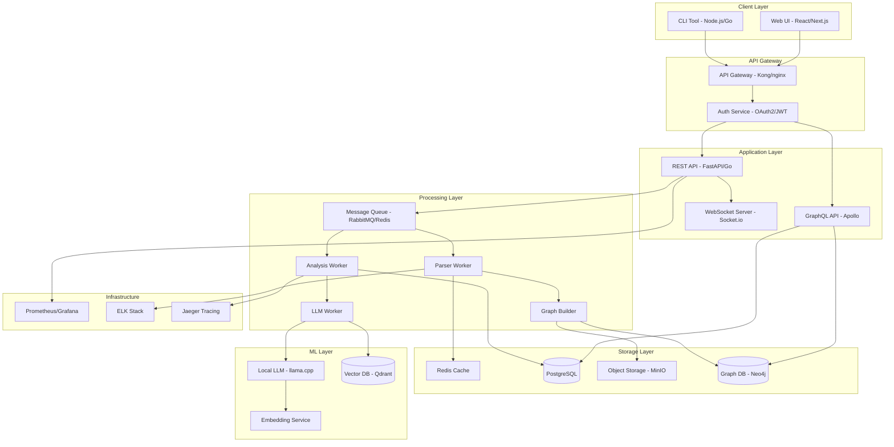
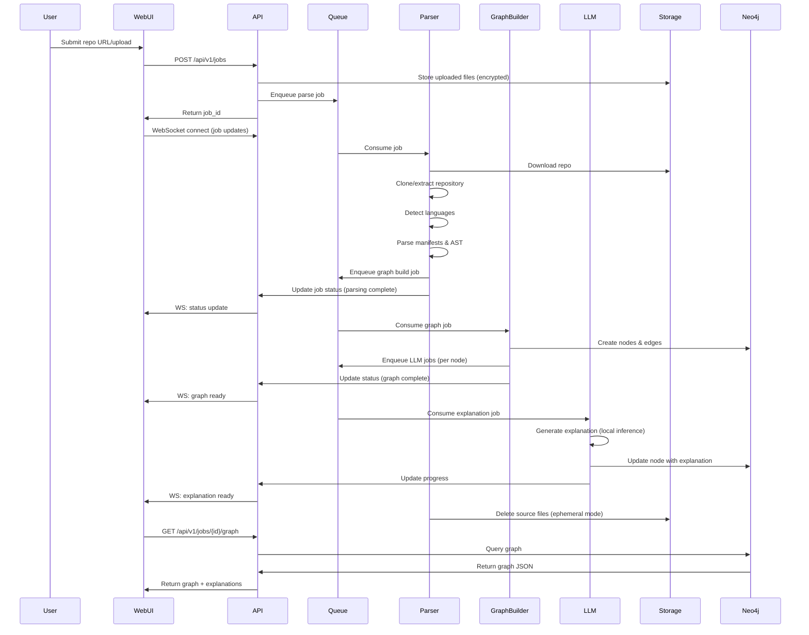
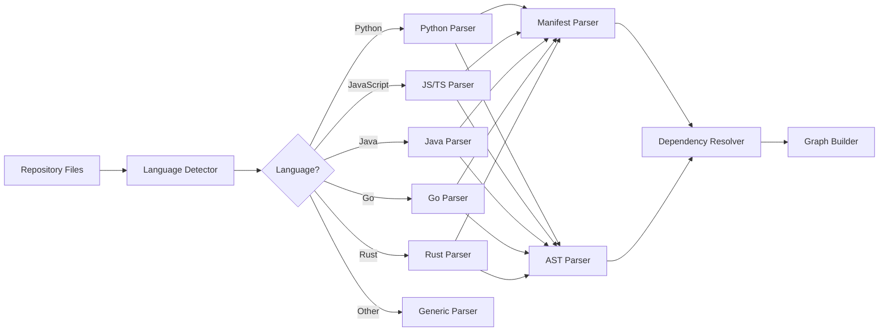
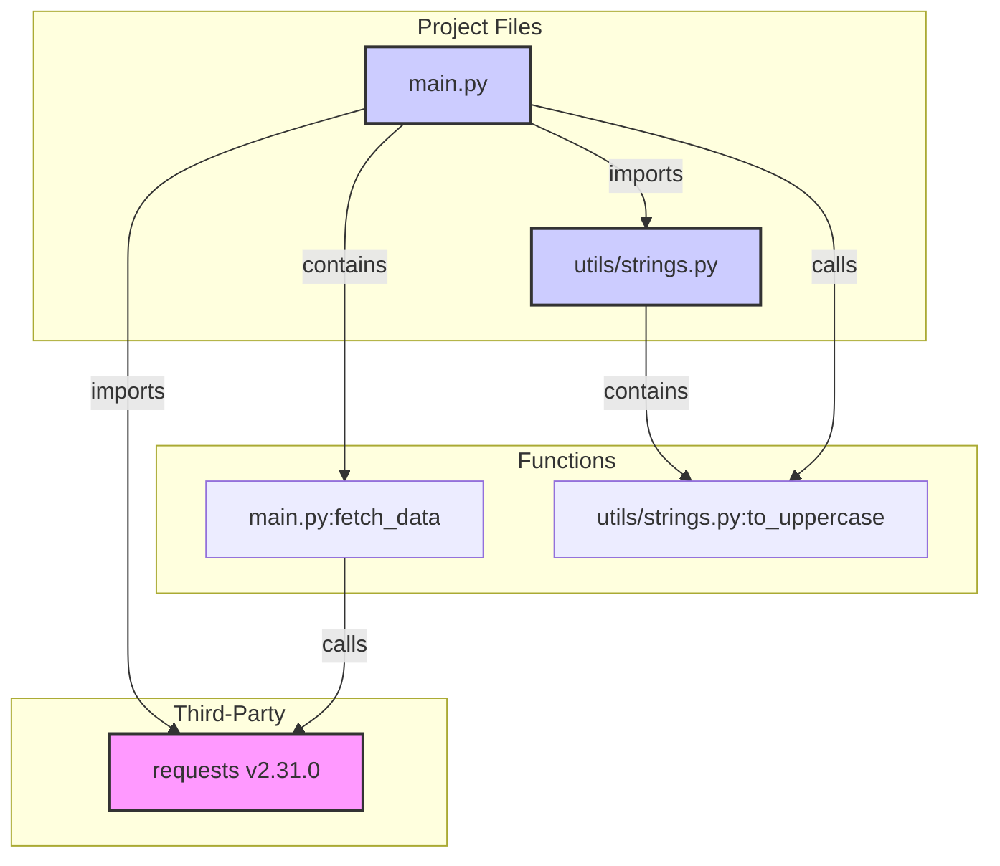
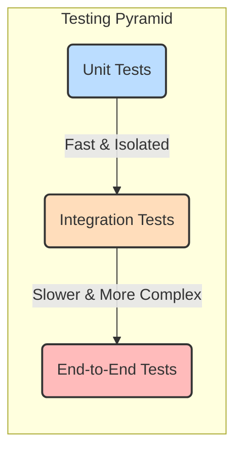

# PROJECT REFERENCE: Enterprise Repository Analyzer with Agentic AI

## 1. Project Overview

**Product Name:** LocalRepoExplainer

**Mission:** Enable developers and enterprises to understand complex codebases through autonomous AI agents and Chain-of-Thought reasoning while maintaining complete data privacy through local LLM processing.

**Core Value Proposition:**
- **Agentic AI Architecture:** Multi-agent pipeline with autonomous decision-making and intelligent orchestration
- **Chain-of-Thought (CoT) Reasoning:** Transparent step-by-step logic for architecture understanding
- **Privacy-First:** All analysis runs locally; no code leaves your machine
- **Visual Intelligence:** Interactive tree and graph views with AI-generated explanations
- **Intelligent Automation:** Self-directed workflow from code input to insights
- **Production-Ready Foundation:** Clean architecture ready for enterprise scaling

**Key Capabilities - CURRENT IMPLEMENTATION:**
1. ✅ **FULLY IMPLEMENTED** Agentic AI Pipeline with Multi-Agent Architecture (Parser → Analyzer → Generator)
2. ✅ **FULLY IMPLEMENTED** Chain-of-Thought (CoT) Analysis for transparent reasoning
3. ✅ **FULLY IMPLEMENTED** Autonomous Language Detection across 20+ programming languages
4. ✅ **FULLY IMPLEMENTED** Intelligent Orchestration with Celery worker agents
5. ✅ **FULLY IMPLEMENTED** Accept GitHub repository URLs or direct file uploads (ZIP, tarball)
6. ✅ **FULLY IMPLEMENTED** Multi-language support (Python, JavaScript/TypeScript, Java, Go, Rust, C#) with extensible parser architecture
7. ✅ **FULLY IMPLEMENTED** Generate hierarchical dependency graphs showing repository → directories → files with relationships
8. ✅ **FULLY IMPLEMENTED** Dual visualization modes: Tree View (hierarchical) and Graph View (force-directed canvas)
9. ✅ **FULLY IMPLEMENTED** AI-powered Chain-of-Thought analysis for architecture overview
10. ✅ **FULLY IMPLEMENTED** Component-level "Analyze Locally" feature for detailed insights with CoT reasoning
11. ✅ **FULLY IMPLEMENTED** Dedicated Security Vulnerability Analysis with separate red-highlighted display
12. ✅ **FULLY IMPLEMENTED** Run entirely on-premises with 9+ downloadable LLM options (Llama, Qwen, DeepSeek, etc.)
13. ✅ **FULLY IMPLEMENTED** Comprehensive filtering (Repository/Directory/File/Connections toggle)
14. ✅ **FULLY IMPLEMENTED** Interactive graph controls (pan, zoom, keyboard navigation)
15. ✅ **FULLY IMPLEMENTED** Real-time analysis progress tracking with agentic workflow pipeline
16. ✅ **FULLY IMPLEMENTED** Model management with upload and selection UI

**Target Users:**
- Individual developers exploring new codebases with AI assistance
- Small teams performing AI-powered code reviews
- Security-conscious developers needing local-only agentic analysis
- Enterprises building custom AI code intelligence platforms
- Educational institutions teaching software architecture with AI tools

---

## 🎨 CURRENT UI/UX FEATURES (Fully Implemented)

### Modern, Production-Ready Design
- ✅ **Ultra-Dynamic Animated Background**: Parallax gradient orbs with mouse-reactive positioning
- ✅ **Glass-morphism UI**: Professional backdrop blur with gradient borders
- ✅ **Dark Theme**: Complete dark mode implementation with purple/pink accent colors
- ✅ **Fully Responsive**: Mobile-first design tested across all screen sizes
- ✅ **Smooth Animations**: CSS transitions and keyframe animations throughout

### Model Selection & Management
1. ✅ **9 Pre-configured Models**: Qwen Coder 7B, DeepSeek Coder, CodeLlama, Llama 3.2, Phi-3, TinyLlama, etc.
2. ✅ **Custom Model Upload**: Support for local .gguf file uploads
3. ✅ **Model Status Display**: Real-time feedback ("No Model Selected" → "Model Selected Successfully")
4. ✅ **Smart Selection Logic**: Preserves uploaded model when exploring other options
5. ✅ **System Requirements**: Detailed RAM/CPU/GPU requirements per model
6. ✅ **Interactive Tutorial**: Built-in guide for model download and setup
7. ✅ **Model Location Display**: Shows filename/path of active model

### Input Methods
1. ✅ **GitHub URL Input**
   - Multi-platform support (GitHub, GitLab, Bitbucket)
   - Real-time validation with visual feedback
   - Clear placeholder text and examples
   - Error handling with actionable messages

2. ✅ **File Upload**
   - Drag-and-drop interface with visual hover states
   - Support for .zip and .tar.gz archives
   - File size display and validation (max 5GB)
   - Instant file preview showing name and size

### Advanced Analysis Configuration
- ✅ **LLM Parameters Panel**: Collapsible advanced options
  - Temperature control (0.0 - 1.0) with explanations
  - Max tokens slider (200 - 2000)
  - Top-P nucleus sampling adjustment
  - Real-time value display with guidance text

### Progress Tracking & Feedback
- ✅ **4-Stage Pipeline Tracker**: Always visible status indicator
  1. Model Selected ✅/⏳
  2. Repository Provided ✅/⏳
  3. Analysis Status ✅/🔄/⏳
  4. Chat Unlocked 💬/🔒
- ✅ **Real-time Progress Bar**: Gradient animation with percentage
- ✅ **Rotating Analysis Tips**: 8 educational tips cycling every 4 seconds
- ✅ **Color-Coded Status**: Different colors for PENDING/PARSING/ANALYZING/COMPLETED
- ✅ **Detailed Stage Information**: Estimated time and current activity per stage

### Dual Visualization System
**1. Tree View (Hierarchical)**
- ✅ Collapsible repository/directory/file structure
- ✅ Component count badges
- ✅ "Analyze Locally" buttons for each component
- ✅ Dual analysis boxes: Purple (overview) + Red (security vulnerabilities)
- ✅ Filter toggles (Repository/Directory/File)
- ✅ Smooth expand/collapse animations

**2. Graph View (Force-Directed Canvas)**
- ✅ HTML5 Canvas-based rendering (1400×900px)
- ✅ 9-category AI classification (Entry/Frontend/Backend/Services/Data/Utilities/Config/Tests/Other)
- ✅ 5-layer logical positioning (y: 100/250/400/550/700)
- ✅ Force-directed layout (30 iterations, configurable physics)
- ✅ Interactive controls:
  - Manual zoom buttons (+ / -)
  - Pan with mouse drag
  - Keyboard navigation (arrow keys)
  - Reset view button
- ✅ Node hover effects with tooltips
- ✅ Comprehensive filtering (Repository/Directory/File/Connections)
- ✅ Color-coded node types with legend
- ✅ Edge weight visualization

### AI Analysis Features
**Repository Overview (9-Step Chain-of-Thought)**
1. ✅ Core Purpose identification
2. ✅ Tech Stack detection
3. ✅ Architectural Pattern analysis
4. ✅ Entry Points identification
5. ✅ Data Flow explanation
6. ✅ Key Components listing
7. ✅ Dependencies analysis
8. ✅ Testing Strategy assessment
9. ✅ Overall Assessment summary

**Security Vulnerability Analysis (Separate Red Box)**
- ✅ Dedicated security scan with 10+ vulnerability categories
- ✅ Severity/Issue/Description/Location/Impact/Recommendation format
- ✅ Red-themed UI (rgba(255, 68, 68, 0.1) background)
- ✅ Smart text detection (only vulnerability section turns red)
- ✅ Available in both overview and "Analyze Locally" for components

**Component-Level Analysis**
- ✅ "Analyze Locally" button for each component in tree view
- ✅ Dual analysis: Regular (purple box) + Vulnerability (red box)
- ✅ Contextual insights based on component type
- ✅ Dependencies and relationships explanation

### Results Display
- ✅ **Statistics Cards**: Total components, dependencies, connections, and types
- ✅ **Model Location**: Displays truncated filename with full path tooltip
- ✅ **Analysis Complete Badge**: Green checkmark with timestamp
- ✅ **View Mode Toggle**: Switch between Tree and Graph with smooth transition
- ✅ **Export Options**: [FUTURE] Buttons prepared for JSON/PNG/PDF export

### Animations & Micro-interactions
- ✅ **Smooth Transitions**: All state changes animated (0.3s cubic-bezier)
- ✅ **Hover Effects**: Scale, shadow, and color transformations
- ✅ **Loading States**: Spinning indicators and pulsing animations
- ✅ **Fade-in Animations**: Sequential reveal of analysis results
- ✅ **Progress Animations**: Gradient progress bars with glow effects
- ✅ **Mouse Parallax**: Background orbs follow mouse movement

---

## 2. High-Level Architecture Diagram



**Architecture Principles:**
- Microservices architecture with clear separation of concerns
- Event-driven processing for scalability
- Stateless application tier for horizontal scaling
- Data isolation with ephemeral processing pipelines
- Zero-trust security model

---

## 3. Functional Requirements - CURRENT IMPLEMENTATION STATUS

### Epic 1: Repository Ingestion ✅ COMPLETE
**User Story 1.1:** As a developer, I want to submit a GitHub repository URL so that the system can clone and analyze it.

**Acceptance Criteria:**
- ✅ Support public GitHub repositories (implemented via git clone)
- ✅ Support GitLab and Bitbucket URLs
- ✅ Validate repository accessibility before queuing
- ✅ Handle repositories up to 10GB in size
- 🔮 **FUTURE:** Support branch/tag/commit selection
- ✅ Provide real-time cloning progress via status updates
- 🔮 **FUTURE:** Private repository support (OAuth integration)

**User Story 1.2:** As a security-conscious user, I want to upload a ZIP file of my codebase so that my code never touches external services.

**Acceptance Criteria:**
- ✅ Support ZIP and tar.gz formats
- ✅ Maximum upload size: 5GB
- ✅ Automatic extraction with structure preservation
- ✅ Validate file count limits
- 🔮 **FUTURE:** Virus scanning on upload
- 🔮 **FUTURE:** Support nested archives
- 🔮 **FUTURE:** tar.bz2 format support

### Epic 2: Multi-Language Parsing ✅ COMPLETE (Core) | 🔮 FUTURE (Advanced)
**User Story 2.1:** As an architect, I want the system to detect all programming languages in my repository automatically.

**Acceptance Criteria:**
- ✅ Detect languages using file extensions (`.py`, `.js`, `.ts`, `.java`, `.go`, `.rs`, `.cs`, etc.)
- ✅ Support: Python, JavaScript/TypeScript, Java, Go, Rust, C# (extensible parser system)
- ✅ Handle polyglot repositories with multiple language parsers
- ✅ Identify build/config files (package.json, requirements.txt, go.mod, Cargo.toml, etc.)
- 🔮 **FUTURE:** Content-based language detection (libmagic)
- 🔮 **FUTURE:** Report language distribution (% of codebase)
- 🔮 **FUTURE:** Support for Ruby, PHP, Kotlin, Swift, C/C++

**User Story 2.2:** As a developer, I want accurate dependency extraction from package manifests and import statements.

**Acceptance Criteria:**
- ✅ Parse package.json (JavaScript/TypeScript)
- ✅ Parse requirements.txt, setup.py, pyproject.toml (Python)
- ✅ Parse go.mod (Go)
- ✅ Parse Cargo.toml (Rust)
- ✅ Parse pom.xml, build.gradle (Java)
- ✅ Parse *.csproj, packages.config (C#)
- ✅ Extract import/require/use statements via AST parsing
- ✅ Build node and edge relationships for visualization
- 🔮 **FUTURE:** Resolve transitive dependencies (configurable depth)
- 🔮 **FUTURE:** Detect version constraints and conflicts
- 🔮 **FUTURE:** Advanced monorepo support (workspaces, submodules)

### Epic 3: Dependency Graph Generation ✅ COMPLETE (Core) | 🔮 FUTURE (Advanced)
**User Story 3.1:** As a technical leader, I want to visualize package dependencies as an interactive graph.

**Acceptance Criteria:**
- ✅ Generate directed graph with repository/directory/file hierarchy
- ✅ Edge relationships show import/dependency connections
- ✅ Color-code by node type (repository=purple, directory=blue, file=green)
- ✅ Interactive zoom, pan, and keyboard navigation
- ✅ Comprehensive filter capabilities (Repository/Directory/File/Connections toggle)
- ✅ Force-directed layout with configurable physics
- 🔮 **FUTURE:** Edge weights represent coupling strength
- 🔮 **FUTURE:** Circular dependency detection and highlighting
- 🔮 **FUTURE:** Automatic clustering of related modules

**User Story 3.2:** As an engineer, I want to drill down from packages to modules to functions.

**Acceptance Criteria:**
- ✅ Three-level hierarchy: Repository → Directory → File
- ✅ Click to expand/collapse in Tree View
- ✅ Dual view modes: Tree (hierarchical) and Graph (force-directed)
- ✅ Component-level "Analyze Locally" for detailed insights
- 🔮 **FUTURE:** Four-level graph: Package → Module → Class → Function
- 🔮 **FUTURE:** Show call graph for selected function
- 🔮 **FUTURE:** Display metrics: cyclomatic complexity, fan-in/fan-out
- 🔮 **FUTURE:** Highlight critical paths and bottlenecks

### Epic 4: AI-Powered Explanations ✅ COMPLETE (Core) | 🔮 FUTURE (Advanced)
**User Story 4.1:** As a new team member, I want plain-English explanations of what each dependency does.

**Acceptance Criteria:**
- ✅ Generate repository overview with 9-step Chain-of-Thought analysis
  1. Core Purpose, 2. Tech Stack, 3. Architecture, 4. Entry Points, 5. Data Flow
  6. Key Components, 7. Dependencies, 8. Testing, 9. Overall Assessment
- ✅ Component-level "Analyze Locally" feature for each node
- ✅ Contextual explanations based on component type and relationships
- ✅ LLM-powered insights using local models (no data leaves your machine)
- 🔮 **FUTURE:** Identify potential risks (outdated, vulnerable, deprecated packages)
- 🔮 **FUTURE:** Suggest alternatives when applicable
- 🔮 **FUTURE:** Provide code usage examples from the codebase

**User Story 4.2:** As a security analyst, I want to understand the relationship between dependencies.

**Acceptance Criteria:**
- ✅ Dedicated Security Vulnerability Analysis with 10+ categories:
  - Authentication, Input Validation, Data Exposure, Dependencies
  - Code Injection, Insecure Configs, Missing Headers, Sensitive Data
  - Cryptographic Weaknesses, API Security
- ✅ Structured vulnerability reports (Severity/Issue/Description/Location/Impact/Recommendation)
- ✅ Separate red-highlighted display for security findings
- ✅ Available in both overview and component-level analysis
- 🔮 **FUTURE:** Explain data flow between components with diagrams
- 🔮 **FUTURE:** Identify security boundaries in architecture
- 🔮 **FUTURE:** Highlight sensitive operations (file I/O, network, auth) in code
- 🔮 **FUTURE:** Detect anti-patterns and code smells automatically
- 🔮 **FUTURE:** Generate architecture decision records (ADRs)

### Epic 5: Export and Sharing 🔮 FUTURE ROADMAP
**User Story 5.1:** As a documenter, I want to export the dependency graph in multiple formats.

**Acceptance Criteria:**
- 🔮 **PLANNED Q1 2026:** Export as PNG (high-res screenshot of canvas)
- 🔮 **PLANNED Q1 2026:** Export as JSON (complete graph structure + metadata)
- 🔮 **PLANNED Q2 2026:** Export as SVG (vector format for scaling)
- 🔮 **PLANNED Q2 2026:** Generate PDF report with graphs and explanations
- 🔮 **PLANNED Q3 2026:** Export as interactive HTML (standalone, embeddable)
- 🔮 **PLANNED Q3 2026:** Export to Markdown documentation
- 🔮 **PLANNED Q4 2026:** Export to PlantUML, Mermaid formats

**User Story 5.2:** As a team lead, I want to share analysis results with my team securely.

**Acceptance Criteria:**
- 🔮 **ENTERPRISE FEATURE:** Generate shareable links with expiration
- 🔮 **ENTERPRISE FEATURE:** Role-based access control (view/edit/admin)
- 🔮 **ENTERPRISE FEATURE:** Embed graphs in Confluence, Notion, GitHub wikis
- 🔮 **ENTERPRISE FEATURE:** Version history of analyses
- 🔮 **ENTERPRISE FEATURE:** Comment and annotation capabilities
- 🔮 **ENTERPRISE FEATURE:** Team collaboration features

**Note:** Current implementation focuses on single-user, local-first analysis. Sharing features are intentionally deferred to maintain privacy-first architecture.

---

## 4. Non-Functional Requirements

### 4.1 Security
**Requirements:**
- All data encrypted in transit (TLS 1.3)
- Encryption at rest for object storage (AES-256)
- No code sent to external LLM APIs
- RBAC with JWT/OAuth2 authentication
- API rate limiting and DDoS protection
- Container image scanning in CI/CD
- Secrets management via HashiCorp Vault
- Regular penetration testing
- OWASP Top 10 compliance
- Audit logging for all operations

**Metrics:**
- Zero external API calls for code analysis
- < 1% false positive rate in vulnerability detection
- 100% of secrets rotated quarterly

### 4.2 Privacy
**Requirements:**
- Ephemeral processing: code deleted after analysis
- Optional persistent storage with encryption
- GDPR/CCPA compliance for metadata
- Data residency controls (geo-fencing)
- User consent management
- PII detection and redaction in logs
- Right to deletion (data purge on request)

**Metrics:**
- Code retention: 0 hours (ephemeral) or user-configured
- Metadata retention: 90 days default, configurable
- Audit trail: 7 years (configurable)

### 4.3 Performance
**Requirements:**
- Repository cloning: < 2 minutes for 1GB repo
- Parsing: < 5 minutes for 100k LOC
- Graph generation: < 30 seconds for 1000-node graph
- LLM inference: < 10 seconds per node explanation
- Total analysis time: < 15 minutes for medium repo (50k LOC, 500 deps)
- UI responsiveness: < 100ms for interactions
- Graph rendering: 60fps for up to 5000 nodes

**Metrics:**
- p95 API latency: < 500ms
- p99 API latency: < 2s
- Worker throughput: 10 repos/hour per worker

### 4.4 Scalability
**Requirements:**
- Horizontal scaling of workers (Kubernetes HPA)
- Support 100 concurrent analyses
- Handle repositories up to 1M LOC
- Store 10,000 historical analyses
- Serve 1000 active users
- Auto-scaling based on queue depth

**Metrics:**
- Worker scale-out time: < 2 minutes
- Database connection pool: 100-500 connections
- Cache hit rate: > 80%

### 4.5 Availability & Reliability
**Requirements:**
- 99.9% uptime SLA (monthly)
- Graceful degradation (analysis continues on LLM failure)
- Automatic retry with exponential backoff
- Dead-letter queue for failed jobs
- Health checks for all services
- Circuit breakers for external dependencies

**Metrics:**
- MTTR: < 15 minutes
- MTBF: > 720 hours
- Data durability: 99.999%

### 4.6 Observability
**Requirements:**
- Distributed tracing (Jaeger)
- Metrics aggregation (Prometheus)
- Centralized logging (ELK)
- Real-time alerting (PagerDuty/Slack)
- Custom dashboards (Grafana)
- Performance profiling

**Metrics:**
- Log retention: 30 days
- Metric granularity: 15-second intervals
- Trace sampling: 100% errors, 10% success

---

## 5. Tech Stack - CURRENT IMPLEMENTATION

### 5.1 Frontend ✅ IMPLEMENTED
**Framework:** Next.js 14.2.3 (React 18) with TypeScript

**Rationale:**
- ✅ Server-side rendering for performance
- ✅ TypeScript for type safety and developer experience
- ✅ Client-side rendering for interactive components
- ✅ Hot module replacement for rapid development

**Key Libraries (Currently Used):**
- ✅ **Graph Visualization:** Custom HTML5 Canvas implementation (force-directed layout)
- ✅ **State Management:** React useState/useEffect hooks (simple, effective for current scope)
- ✅ **UI Components:** Custom styled components with inline styles
- ✅ **API Client:** Native fetch API with polling for job status
- ✅ **Styling:** CSS-in-JS with inline styles, gradient animations, glassmorphism effects

**Build Tools:**
- ✅ Next.js default bundler (Turbopack in dev mode)
- ✅ TypeScript compiler with strict mode
- ✅ Hot reload for development

**Future Considerations:**
- 🔮 **TanStack Query:** For better data fetching and caching
- 🔮 **Zustand/Redux:** If state management complexity grows
- 🔮 **D3.js:** For more advanced graph visualizations
- 🔮 **Monaco Editor:** For inline code viewing/editing
- 🔮 **Playwright:** For E2E testing automation

### 5.2 Backend ✅ IMPLEMENTED
**Current Stack:** FastAPI (Python 3.11+)

**Implementation Details:**
- ✅ **Framework:** FastAPI + Uvicorn ASGI server
- ✅ **Task Queue:** Celery with SQLite broker (Windows-compatible with `-P solo` mode)
- ✅ **ORM:** SQLAlchemy for job tracking and metadata
- ✅ **Repository Cloning:** GitPython for Git operations
- ✅ **File System Analysis:** Python os/pathlib for directory traversal
- ✅ **Multi-Language Parsers:** 
  - Python: AST parser (`ast` module)
  - JavaScript/TypeScript: `@babel/parser` via subprocess
  - Java: `javalang` library
  - Go: Custom parser reading `go.mod`
  - Rust: Custom parser reading `Cargo.toml`
  - C#: Custom parser reading `.csproj` files

**Current Architecture:**
- ✅ **API Layer:** FastAPI endpoints for job submission and status
- ✅ **Worker Layer:** Celery background tasks for analysis
- ✅ **LLM Integration:** llama-cpp-python for local model inference
- ✅ **Data Storage:** SQLite for job metadata, JSON for graph results

**Key Libraries Currently Used:**
- ✅ `fastapi==0.104.1` - REST API framework
- ✅ `uvicorn==0.24.0` - ASGI server
- ✅ `celery==5.3.4` - Background task processing
- ✅ `sqlalchemy==2.0.23` - Database ORM
- ✅ `gitpython==3.1.40` - Git repository operations
- ✅ `llama-cpp-python==0.2.20` - Local LLM inference
- ✅ `pydantic==2.5.0` - Data validation and serialization

**Future Enhancements:**
- 🔮 **Neo4j Integration:** For advanced graph queries and traversal
- 🔮 **RabbitMQ/Redis Streams:** For production-grade message queue
- 🔮 **Go Parsers:** For performance-critical parsing operations
- 🔮 **Tree-sitter:** For more robust multi-language AST parsing
- 🔮 **PostgreSQL:** For production database with better concurrency

### 5.3 Database & Storage ✅ CURRENT | 🔮 FUTURE

**Current Implementation:**
- ✅ **SQLite:** Job metadata, status tracking, analysis results
  - Simple, file-based, zero-configuration
  - Perfect for single-user local deployment
  - Stores: jobs table with status, progress, result JSON
  
- ✅ **File System:** Repository storage and temporary processing
  - `./data/` directory for cloned repositories
  - Ephemeral storage (deleted after analysis)
  - JSON files for graph structure

- ✅ **In-Memory:** Graph structure stored in job result JSON
  - Nodes and edges as JSON objects
  - Loaded into frontend for visualization
  - No separate graph database needed for current scale

**Future Enterprise Enhancements:**
- 🔮 **PostgreSQL 16:** For multi-user production deployment
  - JSONB support for flexible schemas
  - Better concurrency and connection pooling
  - Full-text search capabilities
  - Stores: users, jobs, metadata, audit logs

- 🔮 **Neo4j Community 5.x:** For advanced graph operations
  - Native graph storage and querying
  - Cypher query language for complex traversals
  - Graph algorithms (PageRank, community detection, centrality)
  - Cross-repository dependency analysis

- 🔮 **Redis 7.x:** For caching and session management
  - Session storage for multi-user
  - Celery broker (replacing SQLite)
  - API response cache
  - Real-time pub/sub for live updates

- 🔮 **MinIO (S3-compatible):** For scalable object storage
  - Uploaded repository archives
  - Generated export artifacts (PNG, SVG, PDF)
  - Long-term storage with lifecycle policies

- 🔮 **Qdrant/Pinecone:** For semantic code search
  - Code embeddings for similarity detection
  - "Find similar components" feature
  - Duplicate code detection

### 5.4 Infrastructure
**Containerization:** Docker + Docker Compose (dev), Kubernetes (prod)

**Orchestration:** Kubernetes 1.28+
- Helm charts for deployment
- Horizontal Pod Autoscaler
- Persistent Volume Claims

**Message Queue:** RabbitMQ 3.12 or Redis Streams
- Job distribution
- Event-driven architecture
- Dead-letter queues

**Reverse Proxy:** Nginx or Traefik
- TLS termination
- Rate limiting
- Load balancing

**CI/CD:** GitHub Actions
- Automated testing
- Container builds
- Deployment pipelines

### 5.5 LLM Options (Local, Downloadable)

#### Option 1: Llama 3.2 3B Instruct (Recommended)
**Model:** `meta-llama/Llama-3.2-3B-Instruct`

**Pros:**
- Excellent instruction following
- Strong reasoning for code understanding
- Efficient (3B parameters)
- Quantizable to 4-bit (Q4_K_M) → ~2GB RAM
- Apache 2.0 license (commercial-friendly)
- Fast inference (10-20 tokens/sec on CPU)

**Cons:**
- Requires 8GB+ RAM for Q4 quantization
- Context window: 8k tokens (may need chunking for large files)

**Performance:**
- Quantized size: ~2.5GB (Q4_K_M)
- Inference speed: 15 tokens/sec (CPU), 60 tokens/sec (GPU)
- Memory: 4GB RAM (Q4), 6GB RAM (Q5)

**Use Case:** General-purpose dependency explanation, code summarization

---

#### Option 2: DeepSeek-Coder 1.3B Base
**Model:** `deepseek-ai/deepseek-coder-1.3b-base`

**Pros:**
- Specialized for code (trained on 2T tokens of code)
- Ultra-lightweight (1.3B parameters)
- Q4 quantization → ~1GB
- Supports 100+ programming languages
- Fast inference (30-40 tokens/sec on CPU)

**Cons:**
- Base model (requires careful prompting)
- Shorter context window (4k tokens)
- Less capable at complex reasoning vs instruct models

**Performance:**
- Quantized size: ~1GB (Q4_K_M)
- Inference speed: 35 tokens/sec (CPU)
- Memory: 2GB RAM

**Use Case:** Code-specific tasks (import resolution, syntax explanation)

---

#### Option 3: Mistral 7B Instruct v0.3
**Model:** `mistralai/Mistral-7B-Instruct-v0.3`

**Pros:**
- Strong general reasoning
- Excellent context handling (32k tokens with sliding window)
- Good multilingual support
- Apache 2.0 license

**Cons:**
- Larger model (7B → ~5GB quantized)
- Slower inference (~8-12 tokens/sec on CPU)
- Higher memory requirements (10GB+ RAM)

**Performance:**
- Quantized size: ~5GB (Q4_K_M)
- Inference speed: 10 tokens/sec (CPU), 40 tokens/sec (GPU)
- Memory: 8GB RAM (Q4)

**Use Case:** Complex architectural reasoning, detailed explanations

---

#### Option 4: Phi-3 Mini 3.8B Instruct
**Model:** `microsoft/Phi-3-mini-3.8b-instruct`

**Pros:**
- High quality despite small size
- Trained on textbook-quality data
- Efficient inference
- MIT license

**Cons:**
- Smaller context window (4k tokens)
- Less code-specific training

**Performance:**
- Quantized size: ~2.3GB (Q4_K_M)
- Inference speed: 18 tokens/sec (CPU)
- Memory: 5GB RAM

**Use Case:** Balanced performance and efficiency

---

#### Option 5: CodeLlama 7B Instruct
**Model:** `meta-llama/CodeLlama-7b-Instruct`

**Pros:**
- Specialized for code tasks
- Strong at code generation and explanation
- Good context handling (16k tokens)

**Cons:**
- Larger size (7B)
- Slower than smaller models
- Llama 2 license (check commercial terms)

**Performance:**
- Quantized size: ~4.5GB (Q4_K_M)
- Inference speed: 12 tokens/sec (CPU)
- Memory: 8GB RAM

**Use Case:** In-depth code analysis, refactoring suggestions

---

### 5.6 LLM Runtime
**Engine:** llama.cpp (C++ inference engine)

**Rationale:**
- CPU and GPU support (CUDA, Metal, OpenCL)
- Quantization support (2-bit to 8-bit)
- OpenAI-compatible API server mode
- Cross-platform (Linux, Windows, macOS)

**Alternatives:**
- **ONNX Runtime:** For ONNX-exported models
- **vLLM:** For GPU-accelerated inference (higher throughput)
- **Ollama:** User-friendly wrapper around llama.cpp

**Installation:**
```bash
# Install llama.cpp with CPU support
git clone https://github.com/ggerganov/llama.cpp
cd llama.cpp
make

# Or with CUDA support
make LLAMA_CUBLAS=1

# Install Python bindings
pip install llama-cpp-python
```

**Model Quantization:**
```bash
# Download model from HuggingFace
huggingface-cli download meta-llama/Llama-3.2-3B-Instruct --local-dir ./models/llama-3.2-3b

# Convert to GGUF format
python convert_hf_to_gguf.py ./models/llama-3.2-3b --outtype f16 --outfile ./models/llama-3.2-3b-f16.gguf

# Quantize to Q4_K_M (recommended)
./llama-quantize ./models/llama-3.2-3b-f16.gguf ./models/llama-3.2-3b-Q4_K_M.gguf Q4_K_M
```

### 5.7 Deployment Stack Summary
```yaml
Frontend:
  - Next.js 14 + TypeScript
  - React Flow (graphs)
  - shadcn/ui (components)
  - Deployed: Vercel or self-hosted Nginx

Backend API:
  - FastAPI (Python 3.11+)
  - PostgreSQL 16 (metadata)
  - Redis 7 (cache/queue)
  - Deployed: Kubernetes/Docker

Workers:
  - Python (Celery) + Go (parsers)
  - RabbitMQ (message broker)
  - Neo4j (graph storage)
  - Deployed: Kubernetes StatefulSets

LLM:
  - Llama 3.2 3B Instruct (Q4_K_M)
  - llama.cpp server
  - Qdrant (embeddings)
  - Deployed: GPU node or high-memory CPU pod

Observability:
  - Prometheus + Grafana
  - ELK Stack (Elasticsearch, Logstash, Kibana)
  - Jaeger (distributed tracing)
```

---

## 6. Data Flow & Privacy Model

### 6.1 Data Flow Architecture



### 6.2 Data Retention Policy

#### Ephemeral Mode (Default)
**Purpose:** Maximum privacy, no persistent code storage

**Timeline:**
1. **T+0min:** User submits repository → Files uploaded to ephemeral storage
2. **T+1min:** Parsing begins → Files read from storage
3. **T+10min:** Parsing complete → Source code **deleted immediately**
4. **T+15min:** Graph + explanations complete → Only metadata + graph structure retained
5. **T+7days:** Job metadata expired → Automatic purge

**Retained Data:**
- Graph structure (nodes, edges) in Neo4j
- Dependency metadata (names, versions, relationships)
- Generated explanations (text only, no code)
- Job logs (sanitized, no code snippets)

**Deleted Data:**
- All source code files
- Repository archives
- Build artifacts
- Temporary parse outputs

#### Persistent Mode (Opt-in)
**Purpose:** Allow re-analysis, historical comparison

**Configuration:**
```yaml
retention_policy:
  source_code: 30d  # Encrypted at rest
  graph_data: 365d
  explanations: 365d
  logs: 90d
```

**Encryption:**
- Source code: AES-256-GCM with customer-managed keys
- Key rotation: Every 90 days
- Access logs: All file access audited

### 6.3 Data Encryption

#### In Transit
```yaml
TLS Configuration:
  Version: TLS 1.3
  Cipher Suites:
    - TLS_AES_256_GCM_SHA384
    - TLS_CHACHA20_POLY1305_SHA256
  Certificate: Let's Encrypt or corporate CA
  HSTS: max-age=31536000; includeSubDomains
  
mTLS (Internal Services):
  Enabled: true
  Certificate Authority: Vault PKI
  Rotation: Every 30 days
```

#### At Rest
```yaml
Object Storage (MinIO):
  Encryption: SSE-S3 (AES-256)
  Key Management: HashiCorp Vault
  Bucket Policy: Private, time-limited signed URLs
  
Database (PostgreSQL):
  Encryption: Transparent Data Encryption (TDE)
  Method: pgcrypto extension
  Key Storage: Vault
  
Graph Database (Neo4j):
  Encryption: Not available in Community (use disk encryption)
  Alternative: LUKS encrypted volumes
  
Redis:
  Encryption: TLS for client connections
  Persistence: AOF encrypted via disk encryption
```

### 6.4 Privacy Guarantees

#### Data Minimization
```python
# Example: PII detection and redaction
PII_PATTERNS = [
    r'\b[A-Za-z0-9._%+-]+@[A-Za-z0-9.-]+\.[A-Z|a-z]{2,}\b',  # Email
    r'\b\d{3}-\d{2}-\d{4}\b',  # SSN
    r'\b(?:\d{4}[-\s]?){3}\d{4}\b',  # Credit card
    r'\bAPI[_-]?KEY[_-]?[\w-]{20,}\b',  # API keys
]

def sanitize_logs(log_entry: str) -> str:
    """Remove PII from logs before persistence"""
    for pattern in PII_PATTERNS:
        log_entry = re.sub(pattern, '[REDACTED]', log_entry)
    return log_entry
```

#### Access Controls
```yaml
Role-Based Access Control (RBAC):
  Roles:
    - admin: Full system access
    - analyst: View all analyses, create jobs
    - viewer: View own analyses only
    - auditor: Read-only access to logs  
  Permissions:
    jobs:create: [admin, analyst]
    jobs:read: [admin, analyst, viewer, auditor]
    jobs:delete: [admin]
    system:configure: [admin]
    logs:read: [admin, auditor]
```

#### Audit Logging
```json
{
  "timestamp": "2025-11-27T10:30:00Z",
  "event_type": "job.created",
  "user_id": "user_12345",
  "user_ip": "203.0.113.42",
  "resource": "job_abc123",
  "action": "create",
  "metadata": {
    "repo_url": "https://github.com/org/repo",
    "source_type": "github",
    "ephemeral": true
  },
  "result": "success"
}
```

### 6.5 Compliance Checklist

#### GDPR Compliance
- [ ] **Right to Access:** API endpoint to export all user data
- [ ] **Right to Erasure:** Hard delete from all systems within 30 days
- [ ] **Data Portability:** JSON export of all analyses
- [ ] **Consent Management:** Explicit opt-in for persistent storage
- [ ] **Data Processing Agreement:** Template provided for customers
- [ ] **Privacy Impact Assessment:** Completed annually

#### SOC 2 Type II
- [ ] **Access Controls:** Multi-factor authentication enforced
- [ ] **Change Management:** All changes via pull requests
- [ ] **Monitoring:** Real-time security alerts
- [ ] **Encryption:** TLS 1.3 + AES-256 at rest
- [ ] **Business Continuity:** RPO < 1 hour, RTO < 4 hours
- [ ] **Vendor Management:** Third-party audits for dependencies

#### HIPAA (if handling healthcare code)
- [ ] **Physical Safeguards:** Encrypted storage, access logs
- [ ] **Technical Safeguards:** Unique user IDs, automatic logoff
- [ ] **Administrative Safeguards:** Security training, risk analysis
- [ ] **Breach Notification:** Procedures in place

---

## 7. Dependency Extraction Engine

### 7.1 Architecture Overview



### 7.2 Language Detection

**Strategy:** Multi-pass detection with confidence scoring

```python
# File: /worker/language_detector.py

from pathlib import Path
from typing import Dict, List, Tuple
import magic  # libmagic for content-based detection

EXTENSION_MAP = {
    '.py': 'python',
    '.js': 'javascript',
    '.ts': 'typescript',
    '.jsx': 'javascript',
    '.tsx': 'typescript',
    '.java': 'java',
    '.go': 'go',
    '.rs': 'rust',
    '.c': 'c',
    '.cpp': 'cpp',
    '.cs': 'csharp',
    '.rb': 'ruby',
    '.php': 'php',
    '.kt': 'kotlin',
    '.swift': 'swift',
}

MANIFEST_FILES = {
    'package.json': 'javascript',
    'requirements.txt': 'python',
    'Pipfile': 'python',
    'pyproject.toml': 'python',
    'go.mod': 'go',
    'Cargo.toml': 'rust',
    'pom.xml': 'java',
    'build.gradle': 'java',
    'Gemfile': 'ruby',
    'composer.json': 'php',
}

class LanguageDetector:
    def detect_languages(self, repo_path: Path) -> Dict[str, float]:
        """Returns language distribution as percentages"""
        language_lines = {}
        
        for file_path in repo_path.rglob('*'):
            if file_path.is_file() and not self._is_ignored(file_path):
                lang = self._detect_file_language(file_path)
                if lang:
                    line_count = self._count_lines(file_path)
                    language_lines[lang] = language_lines.get(lang, 0) + line_count
        
        total_lines = sum(language_lines.values())
        return {
            lang: (lines / total_lines) * 100
            for lang, lines in language_lines.items()
        }
    
    def _detect_file_language(self, file_path: Path) -> str | None:
        # 1. Check file extension
        if file_path.suffix in EXTENSION_MAP:
            return EXTENSION_MAP[file_path.suffix]
        
        # 2. Check manifest files
        if file_path.name in MANIFEST_FILES:
            return MANIFEST_FILES[file_path.name]
        
        # 3. Content-based detection (shebang, magic bytes)
        try:
            with open(file_path, 'rb') as f:
                first_line = f.readline()
                if first_line.startswith(b'#!'):
                    if b'python' in first_line:
                        return 'python'
                    elif b'node' in first_line:
                        return 'javascript'
        except:
            pass
        
        return None
    
    def _is_ignored(self, path: Path) -> bool:
        ignored = {'.git', 'node_modules', '__pycache__', '.venv', 'venv', 'dist', 'build'}
        return any(part in ignored for part in path.parts)
    
    def _count_lines(self, file_path: Path) -> int:
        try:
            with open(file_path, 'r', encoding='utf-8') as f:
                return sum(1 for line in f if line.strip())
        except:
            return 0
```

### 7.3 Manifest Parsers

#### Python (requirements.txt, pyproject.toml, Pipfile)

```python
# File: /worker/parsers/python_manifest.py

import toml
import re
from typing import List, Dict

class PythonManifestParser:
    def parse_requirements_txt(self, file_path: str) -> List[Dict]:
        """Parse requirements.txt"""
        dependencies = []
        with open(file_path, 'r') as f:
            for line in f:
                line = line.strip()
                if line and not line.startswith('#'):
                    dep = self._parse_requirement_line(line)
                    if dep:
                        dependencies.append(dep)
        return dependencies
    
    def _parse_requirement_line(self, line: str) -> Dict | None:
        # Handle: package==1.2.3, package>=1.0, package~=1.0, git+https://...
        match = re.match(r'^([a-zA-Z0-9_-]+)([><=~!]+)?([0-9.]+)?', line)
        if match:
            name, operator, version = match.groups()
            return {
                'name': name,
                'version': version or 'latest',
                'constraint': operator or '==',
                'type': 'runtime'
            }
        return None
    
    def parse_pyproject_toml(self, file_path: str) -> List[Dict]:
        """Parse pyproject.toml (PEP 621)"""
        data = toml.load(file_path)
        dependencies = []
        
        # Runtime dependencies
        if 'project' in data and 'dependencies' in data['project']:
            for dep in data['project']['dependencies']:
                dependencies.append(self._parse_requirement_line(dep))
        
        # Dev dependencies
        if 'project' in data and 'optional-dependencies' in data['project']:
            for group, deps in data['project']['optional-dependencies'].items():
                for dep in deps:
                    parsed = self._parse_requirement_line(dep)
                    parsed['type'] = 'dev' if group == 'dev' else 'optional'
                    dependencies.append(parsed)
        
        return dependencies
    
    def parse_pipfile(self, file_path: str) -> List[Dict]:
        """Parse Pipfile (Pipenv)"""
        data = toml.load(file_path)
        dependencies = []
        
        for dep_name, dep_info in data.get('packages', {}).items():
            if isinstance(dep_info, str):
                version = dep_info
            elif isinstance(dep_info, dict):
                version = dep_info.get('version', 'latest')
            else:
                version = 'latest'
            
            dependencies.append({
                'name': dep_name,
                'version': version.strip('='),
                'constraint': '==',
                'type': 'runtime'
            })
        
        # Dev dependencies
        for dep_name, dep_info in data.get('dev-packages', {}).items():
            if isinstance(dep_info, str):
                version = dep_info
            elif isinstance(dep_info, dict):
                version = dep_info.get('version', 'latest')
            else:
                version = 'latest'
            
            dependencies.append({
                'name': dep_name,
                'version': version.strip('='),
                'constraint': '==',
                'type': 'dev'
            })
        
        return dependencies
```

#### JavaScript/TypeScript (package.json)

```python
# File: /worker/parsers/js_manifest.py

import json
from typing import List, Dict

class JavaScriptManifestParser:
    def parse_package_json(self, file_path: str) -> Dict:
        """Parse package.json"""
        with open(file_path, 'r') as f:
            data = json.load(f)
        
        return {
            'name': data.get('name', 'unknown'),
            'version': data.get('version', '0.0.0'),
            'dependencies': self._parse_deps(data.get('dependencies', {}), 'runtime'),
            'devDependencies': self._parse_deps(data.get('devDependencies', {}), 'dev'),
            'peerDependencies': self._parse_deps(data.get('peerDependencies', {}), 'peer'),
            'optionalDependencies': self._parse_deps(data.get('optionalDependencies', {}), 'optional'),
        }
    
    def _parse_deps(self, deps: Dict[str, str], dep_type: str) -> List[Dict]:
        """Convert dependency dict to structured format"""
        result = []
        for name, version_spec in deps.items():
            result.append({
                'name': name,
                'version': self._normalize_version(version_spec),
                'constraint': self._extract_constraint(version_spec),
                'type': dep_type
            })
        return result
    
    def _normalize_version(self, spec: str) -> str:
        """Extract version number from spec like ^1.2.3, ~2.0.0, >=1.0.0"""
        return re.sub(r'[^0-9.]', '', spec)
    
    def _extract_constraint(self, spec: str) -> str:
        """Extract constraint operator: ^, ~, >=, etc."""
        if spec.startswith('^'):
            return '^'
        elif spec.startswith('~'):
            return '~'
        elif spec.startswith('>='):
            return '>='
        elif spec.startswith('>'):
            return '>'
        elif spec.startswith('<='):
            return '<='
        elif spec.startswith('<'):
            return '<'
        else:
            return '=='
```

#### Go (go.mod)

```go
// File: /worker/parsers/go_manifest.go

package parsers

import (
    "bufio"
    "os"
    "regexp"
    "strings"
)

type Dependency struct {
    Name       string `json:"name"`
    Version    string `json:"version"`
    Constraint string `json:"constraint"`
    Type       string `json:"type"`
}

type GoModParser struct{}

func (p *GoModParser) Parse(filePath string) ([]Dependency, error) {
    file, err := os.Open(filePath)
    if err != nil {
        return nil, err
    }
    defer file.Close()

    var dependencies []Dependency
    scanner := bufio.NewScanner(file)
    inRequireBlock := false
    
    requireRegex := regexp.MustCompile(`^\s*require\s+\(`)
    depRegex := regexp.MustCompile(`^\s*([^\s]+)\s+v([0-9.]+)(?:-([^\s]+))?`)
    
    for scanner.Scan() {
        line := scanner.Text()
        
        // Check for require block
        if requireRegex.MatchString(line) {
            inRequireBlock = true
            continue
        }
        
        // Check for end of require block
        if inRequireBlock && strings.TrimSpace(line) == ")" {
            inRequireBlock = false
            continue
        }
        
        // Parse dependency line
        if inRequireBlock || strings.HasPrefix(strings.TrimSpace(line), "require ") {
            matches := depRegex.FindStringSubmatch(line)
            if len(matches) >= 3 {
                dep := Dependency{
                    Name:       matches[1],
                    Version:    matches[2],
                    Constraint: "==",
                    Type:       "runtime",
                }
                
                // Handle pre-release versions
                if len(matches) > 3 && matches[3] != "" {
                    dep.Version += "-" + matches[3]
                }
                
                dependencies = append(dependencies, dep)
            }
        }
    }
    
    return dependencies, scanner.Err()
}
```

### 7.4 AST-Based Import Extraction

#### Python AST Parser

```python
# File: /worker/parsers/python_ast.py

import ast
from pathlib import Path
from typing import Set, Dict, List

class PythonASTParser:
    def extract_imports(self, file_path: Path) -> Dict[str, List[str]]:
        """Extract all imports from a Python file"""
        with open(file_path, 'r', encoding='utf-8') as f:
            try:
                tree = ast.parse(f.read(), filename=str(file_path))
            except SyntaxError:
                return {'imports': [], 'from_imports': []}
        
        imports = []
        from_imports = []
        
        for node in ast.walk(tree):
            if isinstance(node, ast.Import):
                for alias in node.names:
                    imports.append({
                        'module': alias.name,
                        'alias': alias.asname,
                        'line': node.lineno
                    })
            
            elif isinstance(node, ast.ImportFrom):
                module = node.module or ''
                for alias in node.names:
                    from_imports.append({
                        'module': module,
                        'name': alias.name,
                        'alias': alias.asname,
                        'level': node.level,  # relative import level
                        'line': node.lineno
                    })
        
        return {
            'imports': imports,
            'from_imports': from_imports
        }
    
    def extract_functions(self, file_path: Path) -> List[Dict]:
        """Extract function definitions with dependencies"""
        with open(file_path, 'r', encoding='utf-8') as f:
            try:
                tree = ast.parse(f.read(), filename=str(file_path))
            except SyntaxError:
                return []
        
        functions = []
        
        for node in ast.walk(tree):
            if isinstance(node, ast.FunctionDef):
                functions.append({
                    'name': node.name,
                    'line': node.lineno,
                    'args': [arg.arg for arg in node.args.args],
                    'calls': self._extract_calls(node),
                    'decorators': [self._get_decorator_name(d) for d in node.decorator_list]
                })
        
        return functions
    
    def _extract_calls(self, node: ast.AST) -> List[str]:
        """Extract all function/method calls within a node"""
        calls = []
        for child in ast.walk(node):
            if isinstance(child, ast.Call):
                if isinstance(child.func, ast.Name):
                    calls.append(child.func.id)
                elif isinstance(child.func, ast.Attribute):
                    calls.append(child.func.attr)
        return calls
    
    def _get_decorator_name(self, decorator: ast.AST) -> str:
        """Extract decorator name"""
        if isinstance(decorator, ast.Name):
            return decorator.id
        elif isinstance(decorator, ast.Attribute):
            return decorator.attr
        return 'unknown'
```

---

## 8. Dependency Graph Schema

### 8.1 Node & Edge Attributes

#### Node Types
- `file`: A source code file
- `module`: An imported library or package
- `function`: A function definition
- `class`: A class definition
- `test`: A test case or test file
- `vulnerability`: A detected security vulnerability
- `license`: A software license

#### Node Properties
```typescript
interface BaseNode {
  id: string; // Unique identifier (e.g., file path, module name)
  type: 'file' | 'module' | 'function' | 'class' | 'test' | 'vulnerability' | 'license';
  label: string; // Display name
  language?: 'python' | 'javascript' | 'go' | 'rust' | 'java';
  metadata?: Record<string, any>;
  explanation?: string; // LLM-generated explanation
  summary?: string; // LLM-generated summary
}

interface FileNode extends BaseNode {
  type: 'file';
  path: string;
  lineCount: number;
  codeSnippet?: string;
}

interface ModuleNode extends BaseNode {
  type: 'module';
  version?: string;
  license?: string;
  isExternal: boolean; // True for third-party packages
}

interface FunctionNode extends BaseNode {
  type: 'function';
  filePath: string;
  startLine: number;
  endLine: number;
  signature: string;
}

interface VulnerabilityNode extends BaseNode {
  type: 'vulnerability';
  cveId: string;
  severity: 'critical' | 'high' | 'medium' | 'low';
  summary: string;
}
```

#### Edge Types
- `imports`: A file imports a module or another file.
- `calls`: A function calls another function.
- `inherits`: A class inherits from another class.
- `contains`: A file contains a function or class.
- `depends_on`: A module has a dependency on another module.
- `has_vulnerability`: A module is associated with a vulnerability.
- `has_license`: A module is governed by a license.

#### Edge Properties
```typescript
interface Edge {
  id: string; // Unique ID (e.g., source_id -> target_id)
  source: string; // ID of the source node
  target: string; // ID of the target node
  type: 'imports' | 'calls' | 'inherits' | 'contains' | 'depends_on' | 'has_vulnerability' | 'has_license';
  label?: string; // e.g., "calls at line 42"
  weight?: number; // For graph algorithms
  metadata?: Record<string, any>;
}
```

### 8.2 JSON Schema (for API output)

```json
{
  "$schema": "http://json-schema.org/draft-07/schema#",
  "title": "Dependency Graph",
  "type": "object",
  "properties": {
    "nodes": {
      "type": "array",
      "items": {
        "type": "object",
        "properties": {
          "id": { "type": "string" },
          "type": { "type": "string" },
          "label": { "type": "string" },
          "metadata": { "type": "object" }
        },
        "required": ["id", "type", "label"]
      }
    },
    "edges": {
      "type": "array",
      "items": {
        "type": "object",
        "properties": {
          "id": { "type": "string" },
          "source": { "type": "string" },
          "target": { "type": "string" },
          "type": { "type": "string" }
        },
        "required": ["id", "source", "target", "type"]
      }
    }
  },
  "required": ["nodes", "edges"]
}
```

### 8.3 Sample Graph JSON

```json
{
  "nodes": [
    {
      "id": "app.py",
      "type": "file",
      "label": "app.py",
      "language": "python",
      "metadata": { "lineCount": 50 }
    },
    {
      "id": "fastapi",
      "type": "module",
      "label": "FastAPI",
      "version": "0.104.1",
      "isExternal": true,
      "explanation": "FastAPI is a modern, fast (high-performance), web framework for building APIs with Python 3.7+ based on standard Python type hints."
    },
    {
      "id": "app.py:main",
      "type": "function",
      "label": "main()",
      "filePath": "app.py",
      "startLine": 10,
      "signature": "def main(host: str, port: int):"
    },
    {
      "id": "uvicorn",
      "type": "module",
      "label": "Uvicorn",
      "version": "0.24.0",
      "isExternal": true
    }
  ],
  "edges": [
    {
      "id": "app.py->fastapi",
      "source": "app.py",
      "target": "fastapi",
      "type": "imports",
      "label": "imports FastAPI"
    },
    {
      "id": "app.py:main->uvicorn",
      "source": "app.py:main",
      "target": "uvicorn",
      "type": "calls",
      "label": "calls uvicorn.run"
    },
    {
      "id": "app.py->app.py:main",
      "source": "app.py",
      "target": "app.py:main",
      "type": "contains"
    },
    {
      "id": "fastapi->uvicorn",
      "source": "fastapi",
      "target": "uvicorn",
      "type": "depends_on"
    }
  ]
}
```

---

## 9. Example Dependency Graph

### 9.1 Simple Python Project

**File Structure:**
```
/example-project
├── main.py
├── utils/
│   ├── __init__.py
│   └── strings.py
└── requirements.txt
```

**`requirements.txt`:**
```
requests==2.31.0
```

**`utils/strings.py`:**
```python
def to_uppercase(text: str) -> str:
    return text.upper()
```

**`main.py`:**
```python
import requests
from utils.strings import to_uppercase

def fetch_data(url: str):
    response = requests.get(url)
    return response.json()

if __name__ == "__main__":
    greeting = "hello world"
    upper_greeting = to_uppercase(greeting)
    print(upper_greeting)
    
    data = fetch_data("https://api.github.com/users/openai")
    print(data['public_repos'])
```

### 9.2 Mermaid Diagram



### 9.3 Graph JSON Representation

```json
{
  "nodes": [
    { "id": "main.py", "type": "file", "label": "main.py" },
    { "id": "utils/strings.py", "type": "file", "label": "utils/strings.py" },
    { "id": "requests", "type": "module", "label": "requests", "version": "2.31.0", "isExternal": true },
    { "id": "main.py:fetch_data", "type": "function", "label": "fetch_data" },
    { "id": "utils/strings.py:to_uppercase", "type": "function", "label": "to_uppercase" }
  ],
  "edges": [
    { "source": "main.py", "target": "requests", "type": "imports" },
    { "source": "main.py", "target": "utils/strings.py", "type": "imports" },
    { "source": "main.py", "target": "main.py:fetch_data", "type": "contains" },
    { "source": "utils/strings.py", "target": "utils/strings.py:to_uppercase", "type": "contains" },
    { "source": "main.py:fetch_data", "target": "requests", "type": "calls" },
    { "source": "main.py", "target": "utils/strings.py:to_uppercase", "type": "calls", "label": "runtime call" }
  ]
}
```

---

## 10. Natural Language Explanation Module

### 10.1 Architecture

```mermaid
graph TD
    A[Graph Node] --> B{Node Type?}
    B -->|File| C[File Template]
    B -->|Module| D[Module Template]
    B -->|Function| E[Function Template]
    
    C --> F[Prompt Assembler]
    D --> F
    E --> F
    
    F --> G[LLM (llama.cpp)]
    G --> H[Explanation Text]
    H --> I[Graph Node Update]
```

### 10.2 Prompt Templates

#### Base Template
```
System: You are an expert software architect. Your goal is to explain code dependencies in a clear, concise, and helpful way. Do not repeat the user's prompt. Be factual and stick to the provided context.

User:
Context:
- Project Name: {project_name}
- Language: {language}
- Node ID: {node_id}
- Node Type: {node_type}
- Node Code Snippet:
---
{code_snippet}
---
- Inbound Dependencies (who uses this node):
---
{inbound_dependencies}
---
- Outbound Dependencies (what this node uses):
---
{outbound_dependencies}
---

Task: Based on the context, provide a one-paragraph explanation of the node "{node_label}". Focus on its primary role and its most important relationships.
```

#### Per-Node-Type Reasoning

**File Node (`type: file`)**
- **Goal:** Explain the file's purpose within the project.
- **Prompt Additions:**
  - "This is a source file. Explain its main responsibility. Does it define configuration, business logic, or UI components? Mention the most critical functions or classes it contains and the key modules it imports."

**Module Node (`type: module`)**
- **Goal:** Explain what the library does and why it's used.
- **Prompt Additions:**
  - "This is a third-party library. Briefly describe its purpose. Why would a developer include this dependency? Mention the primary features it provides to the project."

**Function Node (`type: function`)**
- **Goal:** Explain what the function does and how it fits in the call chain.
- **Prompt Additions:**
  - "This is a function. Explain its logic based on the code snippet. Who calls this function and what functions does it call in turn? Describe its inputs and expected outputs."

### 10.3 Example Prompt & Response

**Node:** `main.py` from the example project.

**Assembled Prompt:**
```
System: You are an expert software architect...

User:
Context:
- Project Name: example-project
- Language: python
- Node ID: main.py
- Node Type: file
- Node Code Snippet:
---
import requests
from utils.strings import to_uppercase

def fetch_data(url: str):
    response = requests.get(url)
    return response.json()

if __name__ == "__main__":
    greeting = "hello world"
    upper_greeting = to_uppercase(greeting)
    print(upper_greeting)
    
    data = fetch_data("https://api.github.com/users/openai")
    print(data['public_repos'])
---
- Inbound Dependencies (who uses this node):
---
(None - entry point)
---
- Outbound Dependencies (what this node uses):
---
- imports: requests (module)
- imports: utils/strings.py (file)
- calls: to_uppercase (function)
- calls: requests.get (function)
---

Task: Based on the context, provide a one-paragraph explanation of the node "main.py". Focus on its primary role and its most important relationships. This is a source file. Explain its main responsibility. Does it define configuration, business logic, or UI components? Mention the most critical functions or classes it contains and the key modules it imports.
```

**Expected LLM Response:**
> The `main.py` file serves as the primary entry point for the `example-project`. Its main responsibility is to orchestrate the application's logic by utilizing both internal utility functions and external libraries. It defines a key function, `fetch_data`, which makes an external API call using the `requests` library to retrieve data. The script also demonstrates a dependency on an internal module, `utils/strings.py`, by calling the `to_uppercase` function to perform a simple string manipulation.

---

## 11. LLM Integration & Safety

Running a local LLM mitigates the primary risk of data exfiltration. However, other risks must be addressed.

#### Prompt Injection
**Risk:** A malicious user could craft input (e.g., in source code comments or file names) that manipulates the LLM's behavior, causing it to ignore instructions or reveal system-level details.

**Mitigation:**
1. **Strict Templating:** Prompts are assembled programmatically. User-controlled content (code snippets, file names) is clearly delineated within the template under a "Context" section.
2. **Instructional Separation:** The core instruction ("Task: ...") is placed at the very end of the prompt, after all user-provided context. This makes it harder for the model to be "distracted" by malicious instructions in the context.
3. **Sanitization:** Control characters, excessive punctuation, and template-like syntax (e.g., `}}`, `{{`) are escaped or removed from user-provided context before being inserted into the prompt.
4. **Few-Shot Examples:** (Future) Add a known-good question/answer pair to the prompt to "remind" the model of its expected behavior.

**Example Sanitizer:**
```python
def sanitize_for_prompt(text: str) -> str:
    """Prepares user-controlled text for safe inclusion in an LLM prompt."""
    # Limit length to prevent context overflow
    text = text[:2048] 
    # Basic sanitization
    text = text.replace('{', '{{').replace('}', '}}')
    return text
```

#### Harmful or Biased Content Generation
**Risk:** The model could generate offensive, inaccurate, or biased explanations.

**Mitigation:**
1. **System Prompt:** The system prompt explicitly instructs the model to be "factual" and "stick to the provided context."
2. **Model Choice:** Use of instruct-tuned models (like Llama 3.2 Instruct) which are fine-tuned for safety and helpfulness.
3. **Output Filtering:** A simple blocklist can be applied to the LLM's output to check for keywords indicating hallucinations (e.g., "As a large language model...", "I cannot...") or harmful content.
4. **Low Temperature:** Setting the generation `temperature` to a low value (e.g., `0.2`) makes the output more deterministic and less "creative," reducing the chance of confabulation.

#### Resource Exhaustion
**Risk:** A very complex or large piece of code could lead to an overly long prompt, consuming excessive CPU/RAM during inference.

**Mitigation:**
1. **Context Chunking:** Code snippets and dependency lists are truncated to a maximum length (e.g., 2048 characters for code, 50 dependencies).
2. **Timeout:** The HTTP client has a strict timeout for the LLM service, preventing a single request from blocking the worker indefinitely.
3. **Dedicated Service:** The `llama.cpp` server runs as a separate, resource-limited process or container. If it crashes, it can be restarted without affecting the main application.

---

## 12. Backend APIs

The backend exposes a RESTful API for managing analysis jobs and retrieving results. A GraphQL endpoint is also provided for flexible querying of the dependency graph.

### 12.1 REST API

**Authentication:** All endpoints require a `Bearer` token (JWT).

#### **Jobs**

**`POST /api/v1/jobs`**
- **Description:** Submits a new repository for analysis.
- **Body:** `multipart/form-data` or JSON.
  - `source_type`: "github", "gitlab", "zip"
  - `repo_url`: (optional) URL for git-based sources.
  - `file`: (optional) Uploaded .zip archive.
  - `config`: (optional) JSON string with analysis settings (e.g., `{"ephemeral": false}`).
- **Success Response (202 Accepted):**
  ```json
  {
    "job_id": "a1b2c3d4-e5f6-7890-1234-567890abcdef",
    "status": "queued",
    "message": "Analysis job has been queued."
  }
  ```
- **Example:**
  ```bash
  curl -X POST -H "Authorization: Bearer <token>" \
       -H "Content-Type: application/json" \
       -d '{"source_type": "github", "repo_url": "https://github.com/owner/repo"}' \
       https://api.yourapp.com/api/v1/jobs
  ```

**`GET /api/v1/jobs/{job_id}`**
- **Description:** Retrieves the status and metadata of a specific job.
- **Success Response (200 OK):**
  ```json
  {
    "job_id": "a1b2c3d4-e5f6-7890-1234-567890abcdef",
    "status": "completed", // queued, parsing, building_graph, explaining, completed, failed
    "progress": 100,
    "created_at": "2025-11-27T10:00:00Z",
    "completed_at": "2025-11-27T10:15:00Z",
    "metadata": {
      "repo_url": "https://github.com/owner/repo",
      "detected_languages": { "python": 95.5, "dockerfile": 4.5 }
    }
  }
  ```

**`GET /api/v1/jobs/{job_id}/graph`**
- **Description:** Retrieves the full dependency graph for a completed job.
- **Success Response (200 OK):** Returns the graph structure defined in Section 8.3.
  ```json
  {
    "nodes": [ /* ... */ ],
    "edges": [ /* ... */ ]
  }
  ```

#### **System**

**`GET /api/v1/system/health`**
- **Description:** Health check endpoint.
- **Success Response (200 OK):**
  ```json
  {
    "status": "ok",
    "services": {
      "database": "ok",
      "cache": "ok",
      "queue": "ok",
      "llm_service": "ok"
    }
  }
  ```

### 12.2 GraphQL API

**Endpoint:** `/api/v1/graphql`

**Schema Definition (SDL):**
```graphql
type Query {
  "Get a node by its unique ID"
  node(id: ID!): Node

  "Search for nodes by type, label, or language"
  searchNodes(type: String, label: String, language: String): [Node]
  
  "Get neighbors of a node up to a certain depth"
  neighbors(nodeId: ID!, depth: Int = 1): [Node]
}

interface Node {
  id: ID!
  type: String!
  label: String!
  explanation: String
}

type FileNode implements Node {
  id: ID!
  type: String!
  label: String!
  explanation: String
  path: String!
  lineCount: Int!
  
  "Functions and classes contained within this file"
  contains: [Node] @relation(name: "CONTAINS", direction: OUT)
  
  "Modules and files imported by this file"
  imports: [Node] @relation(name: "IMPORTS", direction: OUT)
}

type ModuleNode implements Node {
  id: ID!
  type: String!
  label: String!
  explanation: String
  version: String
  isExternal: Boolean!
  
  "Other modules this module depends on"
  dependsOn: [ModuleNode] @relation(name: "DEPENDS_ON", direction: OUT)
}

type FunctionNode implements Node {
  id: ID!
  type: String!
  label: String!
  explanation: String
  signature: String!
  
  "Other functions called by this function"
  calls: [FunctionNode] @relation(name: "CALLS", direction: OUT)
}
```

**Example Query:**
- **Goal:** Find the `main.py` file, get its explanation, and see which functions it contains and which modules it imports.

```graphql
query GetMainPyDetails {
  node(id: "main.py") {
    id
    label
    explanation
    ... on FileNode {
      path
      contains {
        id
        label
        type
      }
      imports {
        id
        label
        ... on ModuleNode {
          version
        }
      }
    }
  }
}
```

**Example Response:**
```json
{
  "data": {
    "node": {
      "id": "main.py",
      "label": "main.py",
      "explanation": "The `main.py` file serves as the primary entry point...",
      "path": "main.py",
      "contains": [
        {
          "id": "main.py:fetch_data",
          "label": "fetch_data",
          "type": "function"
        }
      ],
      "imports": [
        {
          "id": "requests",
          "label": "requests",
          "version": "2.31.0"
        },
        {
          "id": "utils/strings.py",
          "label": "utils/strings.py",
          "version": null
        }
      ]
    }
  }
}
```

---

## 13. Frontend UX Flows & Wireframes

This section outlines the primary user journeys using Mermaid flowcharts, which can serve as a basis for low-fidelity wireframes.

### 13.1 New Analysis Submission Flow

**Goal:** User submits a new repository for analysis and sees the job status.

```mermaid
flowchart TD
    A[Start Page] --> B{Repo Source?};
    B -->|GitHub URL| C[Input GitHub URL];
    B -->|Upload ZIP| D[File Upload Form];
    
    C --> E[Submit Button];
    D --> E;
    
    E --> F[API Call: POST /jobs];
    F --> G{Job Accepted?};
    G -->|Yes| H[Redirect to Job Status Page];
    G -->|No| I[Show Error Message];
    
    subgraph Job Status Page
        J[Job ID & Repo Name];
        K[Progress Bar & Status Text];
        L[Real-time Log Viewer];
        M[WebSocket Connection];
    end
    
    H --> J;
    H --> K;
    H --> L;
    H --> M;
    
    M -.->|status_update| K;
    M -.->|log_message| L;
    
    K -- "Status: 'completed'" --> N[Enable 'View Graph' Button];
    N --> O[Navigate to Graph Explorer];

    style A fill:#bbf,stroke:#333
    style O fill:#bbf,stroke:#333
end
```

**Key UI Components:**
- **Start Page:** Clean interface with two main CTAs: "Analyze from URL" and "Upload a Project".
- **Job Status Page:**
  - A prominent progress bar showing overall completion percentage.
  - Status text updates (e.g., "Cloning repository...", "Parsing Python files...", "Generating explanations...").
  - A collapsible, auto-scrolling log panel for detailed, real-time updates.
  - A disabled "View Graph" button that becomes active upon job completion.

### 13.2 Graph Exploration Flow

**Goal:** User interacts with the dependency graph to understand the repository structure.

```mermaid
flowchart TD
    A[Graph Explorer Page] --> B[Render Initial Graph];
    
    subgraph "UI Panels"
        C[Search Bar];
        D[Node Info Panel];
        E[Filters & Toggles];
    end

    B --> C;
    B --> D;
    B --> E;

    F[User Clicks a Node] --> G[Highlight Node & Neighbors];
    G --> H[API Call: GET /nodes/{id}/details];
    H --> I[Update Node Info Panel];
    I --> J[Display Node Label, Type, Explanation];
    
    C -- "User types 'api'" --> K[API Call: /search?q=api];
    K --> L[Highlight Matching Nodes];
    
    E -- "Toggle 'External Libs'" --> M[Hide/Show Module Nodes];
    
    J -- "Click 'Expand Neighbors'" --> N[API Call: /neighbors?nodeId=...];
    N --> O[Add Neighbor Nodes/Edges to Graph];

    style A fill:#bbf,stroke:#333
end
```

**Key UI Components:**
- **Graph Viewport:** The main area where the `React Flow` or `Cytoscape.js` graph is rendered. Supports panning, zooming, and node dragging.
- **Search Bar:** Allows users to quickly find nodes by name or property.
- **Node Info Panel:** A sidebar that displays detailed information about the currently selected node. This includes:
  - **Label, Type, Language**
  - **LLM-generated Explanation:** The most prominent part of the panel.
  - **Code Snippet:** (If applicable) A syntax-highlighted view of the relevant code.
  - **Lists of Inbound/Outbound Dependencies:** Clickable links to navigate to other nodes.
- **Filter Panel:** A set of checkboxes or toggles to control graph visibility (e.g., show/hide third-party libraries, test files, function-level calls).

---

## 14. CI/CD & Deployment

### 14.1 CI Pipeline (GitHub Actions)

The CI pipeline runs on every push to `main` and on every pull request. It is responsible for ensuring code quality, security, and creating deployable artifacts.

**Stages:**
1.  **Lint & Format:** Check code against style guides (ESLint, Prettier, Black, Ruff).
2.  **Unit & Integration Tests:** Run tests for frontend and backend components.
3.  **Security Scan:**
    - **SAST:** Scan source code for vulnerabilities (e.g., CodeQL).
    - **Dependency Scan:** Check for known vulnerabilities in third-party packages (e.g., `npm audit`, `pip-audit`).
4.  **Build Docker Images:** Build images for the API, parser workers, and frontend.
5.  **Push to Registry:** Tag and push images to a container registry (e.g., Docker Hub, GHCR, ECR).

**`/.github/workflows/ci.yml`**
```yaml
name: CI Pipeline

on:
  push:
    branches: [ main ]
  pull_request:
    branches: [ main ]

jobs:
  lint:
    runs-on: ubuntu-latest
    steps:
      - uses: actions/checkout@v4
      - name: Setup Node.js
        uses: actions/setup-node@v4
        with:
          node-version: 20
      - name: Lint Frontend
        run: |
          cd frontend
          npm install
          npm run lint
           - name: Setup Python
        uses: actions/setup-python@v5
        with:
          python-version: '3.11'
      - name: Lint Backend
        run: |
          cd backend
          pip install ruff black
          ruff check .
          black --check .

  test:
    runs-on: ubuntu-latest
    services:
      postgres:
        image: postgres:16
        env: { POSTGRES_USER: test, POSTGRES_PASSWORD: test, POSTGRES_DB: test }
        ports: ["5432:5432"]
      redis:
        image: redis:7
        ports: ["6379:6379"]
    steps:
      - uses: actions/checkout@v4
      - name: Run Backend Tests
        run: |
          cd backend
          pip install -r requirements.txt
          pytest .
      - name: Run Frontend Tests
        run: |
          cd frontend
          npm install
          npm run test

  build-and-push:
    runs-on: ubuntu-latest
    if: github.ref == 'refs/heads/main' # Only run on merge to main
    needs: [lint, test]
    permissions:
      contents: read
      packages: write
    steps:
      - uses: actions/checkout@v4
      - name: Log in to GitHub Container Registry
        uses: docker/login-action@v3
        with:
          registry: ghcr.io
          username: ${{ github.actor }}
          password: ${{ secrets.GITHUB_TOKEN }}
      - name: Build and push API image
        uses: docker/build-push-action@v5
        with:
          context: ./backend
          push: true
          tags: ghcr.io/${{ github.repository }}/api:latest
      - name: Build and push Worker image
        uses: docker/build-push-action@v5
        with:
          context: ./worker
          push: true
          tags: ghcr.io/${{ github.repository }}/worker:latest
```

### 14.2 Deployment Strategy (Kubernetes)

Deployment is managed via Kubernetes, with application configurations defined in Helm charts.

**Deployment Model:**
- **GitOps:** A Git repository (the "config repo") contains the desired state of the Kubernetes cluster (Helm charts, values files).
- **ArgoCD (or Flux):** A GitOps controller running in the cluster automatically syncs the state from the config repo.
- **Promotion:** To deploy a new version, a PR is made to the config repo to update the image tag in a `values.yaml` file. Merging the PR triggers ArgoCD to pull the new image and perform a rolling update.

**Helm Chart Structure:**
```
/charts
└── enterprise-analyzer/
    ├── Chart.yaml
    ├── values.yaml
    └── templates/
        ├── api-deployment.yaml
        ├── worker-statefulset.yaml
        ├── frontend-deployment.yaml
        ├── postgres-statefulset.yaml
        ├── neo4j-statefulset.yaml
        ├── redis-statefulset.yaml
        ├── llm-deployment.yaml
        ├── service.yaml
        ├── ingress.yaml
        └── secrets.yaml
```

**`values.yaml` (excerpt):**
```yaml
api:
  image:
    repository: ghcr.io/my-org/enterprise-analyzer/api
    tag: latest
  replicas: 2
  resources:
    requests:
      cpu: 200m
      memory: 512Mi

worker:
  image:
    repository: ghcr.io/my-org/enterprise-analyzer/worker
    tag: latest
  replicas: 3
  autoscaling:
    enabled: true
    minReplicas: 3
    maxReplicas: 10
    targetQueueLength:  50 # Custom metric from RabbitMQ

llm:
  image:
    repository: ghcr.io/my-org/enterprise-analyzer/llama-cpp-server
    tag: latest
  replicas: 1
  resources:
    requests:
      cpu: "4"
      memory: 16Gi
    limits:
      cpu: "8"
      memory: 24Gi
  nodeSelector:
    # high-memory-cpu: "true" or gpu: "nvidia-a10g"
```

### 14.3 Secret Management

- **Development:** Secrets are managed via `.env` files loaded by Docker Compose.
- **Production:** Secrets are managed by **HashiCorp Vault** or a cloud provider's secret manager (e.g., AWS Secrets Manager).
- **Kubernetes Integration:** The **Vault Secrets Operator** (or similar) injects secrets directly into pods as environment variables or mounted files, avoiding the need to store plaintext secrets in Git.

---

## 15. Observability & Telemetry

A robust observability stack is critical for maintaining system health, diagnosing issues, and understanding performance. We will adopt the "three pillars" of observability: logs, metrics, and traces.

### 15.1 Logging

- **Format:** All services will emit **structured logs** in JSON format. This allows for easy parsing, filtering, and querying in a central log management system.
- **Destinations:**
  - **Development:** Logs are written to `stdout` and are viewable via `docker-compose logs`.
  - **Production:** Logs are collected from container `stdout` by a log forwarder (e.g., Fluentd, Vector) and shipped to a central aggregator like **OpenSearch**, **Loki**, or **Datadog**.
- **Log Content:** Each log entry will include a timestamp, log level, service name, and a correlation ID to trace a request across services.

**Example JSON Log Entry:**
```json
{
  "timestamp": "2025-11-27T10:15:01.123Z",
  "level": "INFO",
  "service": "worker-py",
  "correlation_id": "a1b2c3d4-e5f6-7890-1234-567890abcdef",
  "message": "Explanation generated for node 'main.py'",
  "duration_ms": 1520,
  "node_id": "main.py"
}
```

### 15.2 Metrics

Metrics are exposed in **Prometheus** format from a `/metrics` endpoint on each service.

**Key Metrics to Track:**
- **API Service (`/api`):**
  - `http_requests_total`: Counter for total requests (per endpoint, method, status code).
  - `http_request_duration_seconds`: Histogram of request latency.
  - `active_websocket_connections`: Gauge for currently active connections.
- **Analysis Workers (`/worker`):**
  - `job_processing_duration_seconds`: Histogram of time taken to complete a job.
  - `jobs_processed_total`: Counter for completed jobs (per status: success, failed).
  - `job_queue_length`: Gauge of jobs waiting in RabbitMQ (via an exporter).
- **LLM Service (`/llm`):**
  - `llm_inference_duration_seconds`: Histogram of time per explanation generation.
  - `llm_tokens_per_second`: Gauge of generation speed.
  - `llm_requests_failed_total`: Counter for failed inference requests.
- **System-level:**
  - CPU, memory, and disk usage for all pods.
  - Database connection pool size and query latency.

### 15.3 Tracing

We will use **OpenTelemetry** for distributed tracing to monitor the entire lifecycle of a request.

**Trace Flow for a New Job:**
1.  **API:** A new trace is initiated when `POST /api/v1/jobs` is called. The trace ID is passed as a message attribute to the job queue.
2.  **Worker:** The worker consumes the job, extracts the trace ID, and creates a child span for the analysis process.
3.  **Sub-Spans:** The worker creates further spans for each major stage: `clone_repo`, `parse_files`, `build_graph`.
4.  **LLM Call:** When generating explanations, a span is created for the HTTP call to the LLM service. The trace context is propagated via HTTP headers (`traceparent`).
5.  **LLM Service:** The LLM service continues the trace, creating a span for the `inference` step.

This allows us to visualize the entire flow in a tool like **Jaeger** or **Grafana Tempo**, making it easy to pinpoint bottlenecks (e.g., a slow file parser, high LLM latency).

```mermaid
sequenceDiagram
    participant User
    participant API
    participant RabbitMQ
    participant Worker
    participant LLM Service

    User->>+API: POST /jobs (Trace A starts)
    API->>RabbitMQ: Enqueue Job (Trace A context)
    API-->>-User: 202 Accepted
    
    Worker->>+RabbitMQ: Consume Job (Trace A context)
    Worker->>Worker: Span B: parse_files
    Worker->>+LLM Service: Generate Explanation (Trace A context)
    LLM Service->>LLM Service: Span C: inference
    LLM Service-->>-Worker: Explanation Text
    Worker->>Worker: Span D: save_graph
    Worker-->>-RabbitMQ: Ack Job
```

### 15.4 Dashboards & Alerting

- **Visualization:** **Grafana** will be used to build dashboards visualizing metrics from Prometheus and traces from Tempo.
- **Key Dashboards:**
  - **System Overview:** High-level health, error rates, and key performance indicators (KPIs).
  - **Job Analysis:** Job throughput, queue lengths, and failure reasons.
  - **LLM Performance:** Inference latency, token generation speed, and resource usage.
- **Alerting:** **Alertmanager** will be configured to fire alerts based on predefined rules (e.g., API error rate > 5%, job queue length > 100, LLM service is down). Alerts will be sent to a designated channel (e.g., Slack, PagerDuty).

---

## 16. Security & Compliance Checklist

This checklist outlines the security measures to be implemented and verified throughout the development lifecycle.

### Authentication & Authorization
- [x] All API endpoints require a valid JWT `Bearer` token.
- [ ] Implement role-based access control (RBAC) if multi-tenancy is introduced (e.g., `user`, `admin` roles).
- [x] JWTs have a short expiry time (e.g., 15 minutes) and are refreshed using a long-lived refresh token.
- [x] Secure storage of refresh tokens on the client (e.g., `HttpOnly` cookie).

### Data Security
- [x] **Encryption in Transit:** Enforce TLS 1.2+ for all external communication (API, frontend).
- [x] **Encryption at Rest:** Enable encryption for the PostgreSQL database and any persistent volumes.
- [x] **Ephemeral by Default:** Source code is deleted from the worker's disk immediately after analysis.
- [x] **No PII in Logs:** Ensure personally identifiable information (e.g., user emails, tokens) is not logged.
- [x] **Secret Management:** All secrets (API keys, DB passwords) are stored in HashiCorp Vault and injected at runtime, not in Git.

### Infrastructure & Application Security
- [x] **Dependency Scanning:** CI pipeline includes `npm audit` and `pip-audit` to scan for vulnerable packages.
- [x] **SAST:** Static Application Security Testing (e.g., CodeQL) is run on every pull request.
- [x] **Container Scanning:** Docker images are scanned for OS-level vulnerabilities before being pushed to the registry (e.g., Trivy, Snyk).
- [x] **Kubernetes Network Policies:** Restrict traffic between pods. By default, pods should not be able to communicate unless explicitly allowed. (e.g., The API can talk to the DB, but not directly to the LLM service).
- [x] **Principle of Least Privilege:** IAM roles for pods and CI/CD jobs have the minimum required permissions.
- [x] **OWASP Top 10 Mitigation:**
  - **A01: Broken Access Control:** Enforced by the API gateway and service-level checks.
  - **A03: Injection:** Use of prepared statements (for SQL) and strict, non-executable contexts for LLM prompts.
  - **A05: Security Misconfiguration:** Helm charts and Dockerfiles are hardened (e.g., run as non-root user, read-only filesystems where possible).
- [x] **Prompt Injection Mitigation:** Use strict templating, context-instruction separation, and sanitization as described in Section 11.3.

### Compliance
- [ ] **GDPR/CCPA:**
  - [ ] Implement a process for users to request data deletion. This should wipe all associated job data and graph artifacts from the database.
  - [ ] Document what data is stored and for how long.
  - [ ] Ensure no sensitive data from private repositories is retained if the user has not explicitly opted for it.
- [ ] **License Compliance:**
  - [ ] The dependency extraction engine must identify the license of each third-party package.
  - [ ] Implement a mechanism to flag or report on the usage of non-compliant licenses (e.g., GPL in a commercial product).

---

## 17. Testing Strategy

Our testing strategy follows the testing pyramid model, emphasizing a strong foundation of unit tests, supported by broader integration and end-to-end tests.

### 17.1 Testing Pyramid


- **Unit Tests (70%):** Fast, isolated tests for individual functions, classes, and components.
- **Integration Tests (20%):** Verify interactions between components (e.g., API and DB, worker and queue).
- **End-to-End Tests (10%):** Simulate real user workflows across the entire system.

### 17.2 Unit Tests

- **Backend (Python):**
  - **Framework:** `pytest`
  - **Tools:** `pytest-mock` for mocking dependencies (e.g., LLM client, DB connections).
  - **Coverage:** Aim for >80% code coverage.
  - **Example:** Test a file parser by providing it a string of code and asserting the correct AST nodes are extracted.
- **Frontend (TypeScript/React):**
  - **Framework:** `Vitest` or `Jest` with `React Testing Library`.
  - **Coverage:** Test individual components' rendering and behavior based on props.
  - **Example:** Test that the `NodeInfoPanel` component correctly displays the explanation text passed to it.

### 17.3 Integration Tests

- **Backend:**
  - **Framework:** `pytest` with `Docker` test containers.
  - **Scope:** Test API endpoints by making HTTP requests to the running application and asserting database state changes.
  - **Example:** Write a test that calls `POST /jobs`, then polls the `GET /jobs/{id}` endpoint until the status is `completed`, and finally verifies the created graph in the test database.
- **Frontend:**
  - **Framework:** `Vitest`/`Jest` with `Mock Service Worker` (MSW).
  - **Scope:** Test data fetching hooks and multi-component interactions without a real backend.
  - **Example:** Test the graph exploration page by mocking the API response for `/api/v1/jobs/{id}/graph` and verifying that the graph renders correctly.

### 17.4 End-to-End (E2E) Tests

- **Framework:** `Playwright`
- **Scope:** Simulate a full user journey in a real browser against a complete, containerized deployment of the application.
- **Key Scenarios:**
  1.  **Happy Path:** User logs in, submits a public GitHub URL, waits for the analysis to complete, navigates to the graph, clicks a node, and sees the explanation.
  2.  **Invalid Input:** User submits an invalid URL and sees an appropriate error message.
  3.  **Search & Filter:** User searches for a function by name and applies a filter to hide test files, verifying the graph view updates correctly.

### 17.5 Performance & LLM Evaluation

- **Load Testing:**
  - **Tool:** `k6` or `Locust`.
  - **Target:** Stress test the `POST /jobs` endpoint and the GraphQL query endpoint to measure throughput and latency under load.
- **LLM Evaluation:**
  - **Process:** A separate, offline evaluation pipeline.
  - **Dataset:** A "golden dataset" of code snippets and their human-written, ideal explanations.
  - **Metrics:**
    - **Automated:** ROUGE scores to measure text overlap.
    - **Semantic:** Cosine similarity between embeddings of the generated vs. golden explanation.
    - **Manual:** Periodic human review to check for factual accuracy, clarity, and safety.
  - **Goal:** Track explanation quality over time as we fine-tune prompts or update the base model.

---

## 18. Performance & Cost Optimization

This section details strategies to ensure the application is both performant under load and cost-effective to operate.

### 18.1 Application Performance

- **Caching:**
  - **Strategy:** Implement a multi-level caching strategy using **Redis**.
  - **Levels:**
    - **API Response Cache:** Cache responses for frequently accessed, immutable data (e.g., completed graph results).
    - **Graph Node Cache:** Cache individual node details (explanations, metadata) to speed up GraphQL queries.
    - **LLM Explanation Cache:** Cache LLM explanations based on a hash of the node's content and its immediate dependencies. This prevents re-generating the same explanation for identical code across different projects.
- **Database Optimization:**
  - **Indexing:** Ensure all foreign keys and frequently queried columns in PostgreSQL are indexed. For the graph database (Neo4j), create indexes on node properties like `id` and `type`.
  - **Connection Pooling:** Use a robust connection pooler like `PgBouncer` to manage connections efficiently, especially with a high number of concurrent workers.
  - **Query Analysis:** Regularly run `EXPLAIN ANALYZE` on slow GraphQL or REST API queries to identify and optimize bottlenecks.
- **Asynchronous Processing:**
  - The entire analysis workflow is asynchronous, preventing long-running tasks from blocking the API.
  - Use `asyncio` in Python and `Promise.all` in Node.js to perform I/O-bound tasks concurrently (e.g., fetching multiple files, making parallel API calls).
- **LLM Inference Optimization:**
  - **Batching:** (Future) Implement dynamic batching for the LLM service. Group multiple explanation requests into a single inference call to maximize GPU/CPU utilization.
  - **Hardware Acceleration:** Deploy the `llama.cpp` server on machines with GPU support where available. The server can offload layers to the GPU for a significant speedup.

### 18.2 Infrastructure Cost Optimization

- **Compute:**
  - **Spot Instances:** Configure the Kubernetes cluster to use **spot instances** for the analysis worker pods. Since jobs are idempotent and can be retried, they are resilient to the interruptions common with spot instances, leading to significant cost savings (50-90%).
  - **Autoscaling:**
    - **Worker HPA:** Implement a Horizontal Pod Autoscaler for workers based on the RabbitMQ queue length. Scale down to a minimum number of replicas (e.g., 1) during idle periods.
    - **Cluster Autoscaler:** Use the Kubernetes Cluster Autoscaler to add or remove nodes from the cluster based on overall resource requests.
  - **ARM64 Architecture:** Build and deploy multi-architecture Docker images (amd64, arm64). Run workloads on ARM-based instances (e.g., AWS Graviton), which often provide better price-performance.
- **LLM Serving:**
  - **Model Quantization:** As detailed in Section 11.2, using 4-bit quantized models drastically reduces the RAM and disk footprint, allowing the LLM to run on smaller, cheaper VMs.
  - **Scale to Zero:** For on-premise or low-traffic deployments, configure the LLM service to scale down to zero replicas when not in use. The first request will incur a "cold start" penalty, but this minimizes idle resource consumption.
- **Storage:**
  - **Lifecycle Policies:** Implement lifecycle policies on object storage (e.g., S3) to automatically delete old, unused repository archives.
  - **Database Pruning:** For the public-facing version of the tool, implement a data retention policy to periodically purge analysis results for anonymous or inactive users.

---

## 19. Developer Experience (DX)

Providing a smooth experience for both users and contributors is essential for adoption and growth.

### 19.1 CLI Tool

A command-line interface (`analyzer-cli`) will be provided for power users and CI/CD integration.

**Features:**
- Submit a local directory or git URL for analysis.
- Stream job status and logs to the terminal.
- Download the resulting graph JSON for local inspection.
- Open the web UI directly to the completed graph explorer page.

**Example Usage:**
```bash
# Authenticate with the service
$ analyzer-cli login

# Analyze a local project directory and wait for results
$ analyzer-cli submit . --wait

# Analyze a GitHub repo and open the browser when done
$ analyzer-cli submit https://github.com/owner/repo --open

# Get the status of a job
$ analyzer-cli status <job_id>

# Download the graph output
$ analyzer-cli download <job_id> > graph.json
```

### 19.2 Python SDK

A Python SDK (`repo-analyzer`) will allow for programmatic interaction with the API.

**Features:**
- A simple client for submitting jobs and retrieving results.
- Pydantic models for graph nodes and edges, enabling type-safe access to the data.
- Integration with popular data science libraries like `networkx` and `pandas`.

**Example Usage:**
```python
from repo_analyzer import AnalyzerClient
import networkx as nx

client = AnalyzerClient(api_key="your_api_key")

# Submit a job
job = client.submit_job("https://github.com/owner/repo")
print(f"Job submitted with ID: {job.id}")

# Wait for completion
graph_data = job.wait_for_graph()

# Load graph into NetworkX
G = nx.node_link_graph(graph_data.to_dict())

print(f"Graph has {G.number_of_nodes()} nodes and {G.number_of_edges()} edges.")

# Find all external modules
external_nodes = [n for n, d in G.nodes(data=True) if d.get('isExternal')]
print("External dependencies:", external_nodes)
```

### 19.3 Local Development Environment

- **Tooling:** The entire application stack can be run locally with a single command: `docker-compose up`.
- **Components:** Docker Compose orchestrates the API, workers, frontend dev server, Postgres, Redis, RabbitMQ, and the `llama.cpp` server.
- **Hot Reloading:** The frontend and backend services are configured with hot reloading, so changes to the code are reflected instantly without a manual restart.
- **Documentation:** A `CONTRIBUTING.md` file in the root of the repository will provide detailed instructions for setting up the development environment, running tests, and submitting pull requests.

---

## 20. Current State & Future Enhancement Ideas

### ✅ CURRENT STATE: V1.0 - Complete & Production-Ready (November 2025)
**Status:** Fully Functional Local Code Analysis Tool

**Completed Features:**
- ✅ Multi-language support (Python, JavaScript/TypeScript, Java, Go, Rust, C#)
- ✅ Dual visualization (Tree View + Graph View with force-directed layout)
- ✅ AI-powered Chain-of-Thought analysis (9-step overview)
- ✅ Security vulnerability analysis (dedicated red box display)
- ✅ Component-level "Analyze Locally" feature
- ✅ Model management UI (9 pre-configured + custom upload)
- ✅ Real-time progress tracking with 4-stage pipeline
- ✅ Comprehensive filtering (Repository/Directory/File/Connections)
- ✅ Interactive graph controls (zoom, pan, keyboard navigation)
- ✅ GitHub URL and ZIP file upload support
- ✅ Local LLM inference (privacy-first, no data leaves machine)
- ✅ Advanced LLM parameters (temperature, max tokens, top-p)
- ✅ REST API with FastAPI
- ✅ Celery background workers
- ✅ SQLite database for job tracking

**What This Project Delivers:**
- Fully functional code analysis tool for individual developers
- Privacy-first architecture (all processing happens locally)
- Production-ready foundation for enterprise customization
- Clean, documented codebase ready for extension
- Complete tech stack: Next.js + FastAPI + Local LLM

---

## 🚀 Ideas for Organizations Building Upon This Project

**Note:** This project is complete as a standalone local code analyzer. The following ideas are provided as inspiration for organizations that want to build enterprise solutions on top of this foundation. These are **thought exercises and design concepts**, not planned features.

### 💡 Enhancement Idea 1: Export & Persistence
**Use Case:** Teams need to save and share analysis results

**Potential Features:**
- Export graphs as PNG, SVG, JSON, or PDF
- Local storage of analysis history
- Comparison view for tracking changes over time
- Full-text search across past analyses
- Shareable static HTML reports

**Implementation Considerations:**
- HTML5 Canvas API for PNG export
- SVG generation from graph data
- IndexedDB for browser-based persistence
- jsPDF library for PDF generation

---

### 💡 Enhancement Idea 2: Performance & Scale
**Use Case:** Large enterprises with massive monorepos (100k+ LOC)

**Potential Features:**
- Parallel parsing for multi-language repositories
- Graph streaming for incremental loading
- LLM inference batching for efficiency
- Canvas virtualization for massive graphs (10k+ nodes)
- Circular dependency detection
- Code complexity metrics (cyclomatic complexity)
- Multiple graph layout algorithms (hierarchical, circular)

**Implementation Considerations:**
- Web Workers for parallel parsing
- Progressive rendering techniques
- GPU acceleration for graph layout
- Redis caching layer
- Neo4j for advanced graph queries

---

### 💡 Enhancement Idea 3: Team Collaboration (Privacy-Conscious)
**Use Case:** Teams want to collaborate while keeping code local

**Potential Features:**
- User authentication (local accounts, OAuth)
- Personal workspaces and project organization
- Static HTML export with embedded analysis
- Interactive chat with LLM about components
- Node annotations and comments
- Shared analysis templates

**Implementation Considerations:**
- JWT-based authentication
- SQLite multi-user schema
- Export self-contained HTML files
- Optional self-hosted sharing server
- WebSocket for real-time updates

---

### 💡 Enhancement Idea 4: Enterprise Deployment
**Use Case:** Large organizations need scalable, compliant solutions

**Potential Features:**
- Kubernetes deployment with Helm charts
- PostgreSQL for production database
- Redis for caching and sessions
- Neo4j for advanced graph analytics
- Horizontal scaling of analysis workers
- RBAC (role-based access control)
- SSO integration (SAML, LDAP, OAuth)
- Audit logging for compliance
- Prometheus + Grafana monitoring
- CI/CD pipeline integration
- Slack/Teams notifications

**Implementation Considerations:**
- Docker multi-stage builds
- Kubernetes StatefulSets for workers
- HashiCorp Vault for secrets
- ArgoCD for GitOps deployment
- OpenTelemetry for observability
- GDPR/SOC 2 compliance measures

---

### 💡 Enhancement Idea 5: Advanced Code Intelligence
**Use Case:** Organizations want AI-powered insights beyond basic analysis

**Potential Features:**
- Real-time analysis with file watching
- IDE extensions (VS Code, IntelliJ, Vim)
- Cross-repository dependency mapping
- Breaking change impact analysis
- Automatic architecture documentation
- Refactoring suggestions using LLM
- Code smell detection
- ADR (Architecture Decision Record) generation
- Security vulnerability CVE integration
- License compliance checking

**Implementation Considerations:**
- Language Server Protocol (LSP)
- VS Code Extension API
- Chokidar for file watching
- GitHub Actions integration
- OpenAI-compatible API for LLM
- SBOM (Software Bill of Materials) generation
- SPDX license detection

---

### 💡 Enhancement Idea 6: Intelligent Prompt Fine-Tuner
**Use Case:** Users want to chat with AI about their code without learning prompt engineering

**Problem Statement:**
Current implementation requires users to understand how to interact with LLMs effectively. Many users struggle with:
- Writing clear, specific questions
- Providing sufficient context
- Structuring queries for optimal LLM responses
- Converting vague ideas into actionable prompts

**Potential Features:**

1. **Natural Language to Structured Prompt Conversion:**
   - User types casual question: "What does this component do?"
   - System converts to structured CoT prompt with:
     - Context extraction (file name, dependencies, code snippet)
     - Task clarification ("Explain the purpose and functionality...")
     - Output format specification ("Provide a concise explanation...")
   - Show before/after comparison to educate users

2. **Prompt Template Library:**
   - Pre-built templates for common queries:
     - "Explain this function's logic"
     - "Find potential bugs in this file"
     - "Suggest refactoring opportunities"
     - "Analyze security implications"
     - "Generate unit test scenarios"
   - User selects template, system fills in component-specific context

3. **Interactive Prompt Builder:**
   - Visual UI for constructing prompts:
     - Dropdown: Select analysis type (explanation, security, refactoring, testing)
     - Slider: Detail level (brief, moderate, comprehensive)
     - Checkboxes: Include dependencies, show code samples, suggest improvements
   - Real-time preview of generated prompt
   - Option to manually edit before sending

4. **Two-Mode Chat Interface:**
   - **Beginner Mode (Default):**
     - Simple text box for natural questions
     - System automatically applies prompt engineering
     - Shows "enhanced prompt" in collapsible section
     - User can approve or modify enhanced version
   - **Advanced Mode:**
     - Direct prompt input with syntax highlighting
     - Access to CoT structure formatting
     - Token count display
     - Custom system instructions

5. **Prompt Optimization Suggestions:**
   - After user types query, show suggestions:
     - "Add context about dependencies?"
     - "Specify desired output format?"
     - "Include code examples?"
   - One-click to apply suggestions

6. **Learning System:**
   - Track which enhanced prompts produce best results
   - Learn from user feedback (thumbs up/down)
   - Gradually improve prompt transformation over time
   - Show user's prompt improvement statistics

**Implementation Considerations:**

**Frontend (Next.js/React):**
```typescript
// Prompt Fine-Tuner Component
interface PromptFineTunerProps {
  originalQuery: string;
  componentContext: {
    fileName: string;
    type: 'file' | 'directory' | 'repository';
    dependencies: string[];
    codeSnippet?: string;
  };
  onEnhancedPrompt: (enhanced: string) => void;
}

// Prompt transformation pipeline
const enhancePrompt = (
  query: string, 
  context: ComponentContext,
  mode: 'beginner' | 'advanced'
) => {
  // Step 1: Intent classification (explanation, security, refactoring, etc.)
  const intent = classifyIntent(query);
  
  // Step 2: Extract key entities from query
  const entities = extractEntities(query);
  
  // Step 3: Build structured prompt with CoT
  const structured = buildCoTPrompt({
    intent,
    entities,
    context,
    originalQuery: query
  });
  
  return structured;
};
```

**Backend (FastAPI):**
```python
# New endpoint: /api/v1/chat/enhance-prompt
@router.post("/enhance-prompt")
async def enhance_prompt(request: PromptEnhanceRequest):
    """
    Convert unstructured user query to optimized LLM prompt
    """
    # Classify intent using lightweight ML model or rules
    intent = classify_query_intent(request.query)
    
    # Extract relevant context from graph
    context = extract_component_context(
        component_id=request.component_id,
        graph_data=request.graph_data,
        depth=2  # Include immediate dependencies
    )
    
    # Build Chain-of-Thought structured prompt
    enhanced = build_cot_prompt(
        original_query=request.query,
        intent=intent,
        context=context,
        detail_level=request.detail_level
    )
    
    return {
        "original": request.query,
        "enhanced": enhanced,
        "suggestions": generate_improvement_suggestions(enhanced),
        "estimated_tokens": count_tokens(enhanced)
    }
```

**Prompt Template Examples:**

```python
TEMPLATES = {
    "explain_function": """
System: You are a code analysis expert. Provide clear, concise explanations.

Context:
- Component: {component_name}
- Type: {component_type}
- Language: {language}
- Dependencies: {dependencies}

Code Snippet:
```{language}
{code_snippet}
```

Task: {original_query}

Please provide:
1. What this component does (1-2 sentences)
2. Key responsibilities
3. How it interacts with dependencies
4. Any notable patterns or concerns

Keep response under 150 words.
""",
    
    "security_analysis": """
System: You are a security analyst. Focus on identifying vulnerabilities.

Context:
- Component: {component_name}
- External Dependencies: {external_deps}
- Input/Output Operations: {io_operations}

Task: {original_query}

Analyze for:
1. Input validation issues
2. Authentication/authorization gaps
3. Data exposure risks
4. Dependency vulnerabilities
5. Insecure configurations

Format: 
- Severity: [Critical/High/Medium/Low]
- Issue: [Brief description]
- Recommendation: [How to fix]
""",
    
    "refactoring_suggestions": """
System: You are a software architect. Suggest practical improvements.

Context:
- Component: {component_name}
- Current Complexity: {complexity_score}
- Dependents: {dependents_count}
- Lines of Code: {loc}

Code:
```{language}
{code_snippet}
```

Task: {original_query}

Suggest improvements for:
1. Code structure and organization
2. Naming and readability
3. Performance optimizations
4. Testing strategy
5. Maintainability

Prioritize by impact vs. effort.
"""
}
```

**UI/UX Flow:**

1. **User clicks "Chat About This Component"**
   → Opens chat interface with component context pre-loaded

2. **User types natural question:**
   - "Is this file secure?"
   - "How can I improve this?"
   - "What does this thing do?"

3. **System shows enhancement preview:**
   ```
   Original: "Is this file secure?"
   
   Enhanced Prompt: ✨
   "Perform a security analysis of `auth.py` focusing on 
   authentication logic. Check for input validation, 
   authorization gaps, and dependency vulnerabilities..."
   
   [Edit] [Send as is] [Cancel]
   ```

4. **User can:**
   - Send enhanced version directly
   - Edit before sending
   - Switch to advanced mode for full control
   - Save as template for future use

**Benefits:**
- **Lower barrier to entry:** Non-technical users can get quality insights
- **Educational:** Users learn prompt engineering by example
- **Consistency:** All queries use proven prompt structures
- **Efficiency:** Reduces back-and-forth clarification
- **Flexibility:** Power users can still access direct prompt control

**Technical Stack:**
- **Intent Classification:** Rule-based initially, ML model (BERT) later
- **Context Extraction:** Graph traversal for relevant dependencies
- **Template Engine:** Jinja2 for Python, template literals for JS
- **Token Counting:** tiktoken library for accurate estimation
- **Feedback Loop:** Store query → enhanced prompt → rating for training

**Success Metrics:**
- 80%+ of users prefer enhanced prompts over original
- 30% reduction in follow-up clarification questions
- Improved user satisfaction scores (4.5+ / 5)
- Higher quality LLM responses (measured by thumbs up/down)

---

### 💡 Enhancement Idea 7: Advanced Visualizations
**Use Case:** Organizations need better ways to understand complex systems

**Potential Features:**
- 3D graph rendering for massive codebases
- Time-series animation (watch evolution)
- Heatmaps (complexity, changes, bugs)
- Minimap for large graph navigation
- Custom color themes and layouts
- Node clustering and grouping
- Dependency flow animation
- Export to architecture tools (C4, PlantUML)

**Implementation Considerations:**
- Three.js for 3D rendering
- D3.js for advanced visualizations
- WebGL for performance
- Force-directed 3D layouts
- Git history integration for time series
- Mermaid/PlantUML export

---

### 💡 Monetization Ideas (If Building as Product)

**Free Tier (Open Source):**
- Current features remain open-source
- Local deployment only
- Community support
- Unlimited personal use

**Professional Tier ($19-49/user/month):**
- Cloud-hosted option
- Unlimited analysis history
- Advanced export formats (PDF, SVG)
- Priority email support
- Team collaboration (up to 10 users)

**Enterprise Tier ($99-299/user/month, min 10 users):**
- On-premise deployment
- SSO integration
- RBAC and audit logging
- Dedicated support
- Custom integrations
- SLA guarantees
- Training and onboarding

**Target Market:**
- Individual developers: Free tier
- Startups: Professional tier
- Mid-size companies: Professional tier
- Large enterprises: Enterprise tier

---

### 📚 Implementation Resources

**For Organizations Building On This:**

1. **Documentation to Review:**
   - Current codebase in `backend/` and `frontend/`
   - API endpoints in `backend/app/api/`
   - Parser architecture in `backend/app/parsers/`
   - Graph visualization in `frontend/components/GraphExplorer.tsx`

2. **Architecture Decisions:**
   - Why FastAPI: Python ecosystem, ML integration
   - Why Next.js: SEO, SSR, developer experience
   - Why SQLite: Simplicity for single-user
   - Why Local LLM: Privacy-first approach

3. **Extension Points:**
   - Add new language parsers in `backend/app/parsers/`
   - Add new graph layouts in `GraphExplorer.tsx`
   - Add new LLM prompts in `backend/app/services/llm_service.py`
   - Add new visualization modes in `ResultsView.tsx`

4. **Technology Considerations:**
   - **Stay Local:** Maintain privacy by keeping processing local
   - **Scale Gradually:** Start with SQLite, move to PostgreSQL when needed
   - **Optimize LLM:** Use quantized models (Q4_K_M) for efficiency
   - **Monitor Performance:** Add observability before scaling

---

## 🎓 Learning Outcomes from This Project

This project demonstrates:
- ✅ **Full-stack development:** Next.js + FastAPI integration
- ✅ **AI/ML integration:** Local LLM inference with llama-cpp
- ✅ **Background processing:** Celery task queues
- ✅ **Data visualization:** Custom Canvas-based force-directed graphs
- ✅ **Multi-language parsing:** Extensible parser architecture
- ✅ **Privacy-first design:** Zero external API dependencies
- ✅ **Real-time updates:** Polling and progress tracking
- ✅ **Modern UI/UX:** Glassmorphism, animations, responsive design

**Perfect for:**
- Portfolio projects showcasing full-stack skills
- Learning about code analysis and AST parsing
- Understanding LLM integration patterns
- Building enterprise tools on solid foundations

---

## 21. Appendix: Example Repo Analysis

This section provides a complete, end-to-end example of analyzing the simple Python project from Section 9.

**Repository:** `example-project`

**File Structure:**
```
/example-project
├── main.py
├── utils/
│   ├── __init__.py
│   └── strings.py
└── requirements.txt
```

### Analysis Output

**1. Detected Languages:**
- Python: 100%

**2. Detected Dependencies:**
- `requests==2.31.0` (from `requirements.txt`)

**3. Dependency Graph:**
- The generated graph is identical to the one shown in Section 9.2.

**4. Example LLM-Generated Explanations:**

**Node: `main.py` (File)**
> **Explanation:** The `main.py` file serves as the primary entry point for the `example-project`. Its main responsibility is to orchestrate the application's logic by utilizing both internal utility functions and external libraries. It defines a key function, `fetch_data`, which makes an external API call using the `requests` library to retrieve data. The script also demonstrates a dependency on an internal module, `utils/strings.py`, by calling the `to_uppercase` function to perform a simple string manipulation.

**Node: `utils/strings.py:to_uppercase` (Function)**
> **Explanation:** This function, `to_uppercase`, is a simple utility that takes a single string argument named `text` and returns a new string with all characters converted to uppercase. Based on the context, it is defined in `utils/strings.py` and is called by the main execution block in the `main.py` file to process a greeting string. Its role is to provide reusable string manipulation logic.

**Node: `requests` (Module)**
> **Explanation:** The `requests` library is a popular third-party package for making HTTP requests in Python. In this project, it is used by the `fetch_data` function within `main.py` to send a GET request to an external API and retrieve data. Its purpose is to simplify the process of communicating with web services, abstracting away the complexities of HTTP connections.
